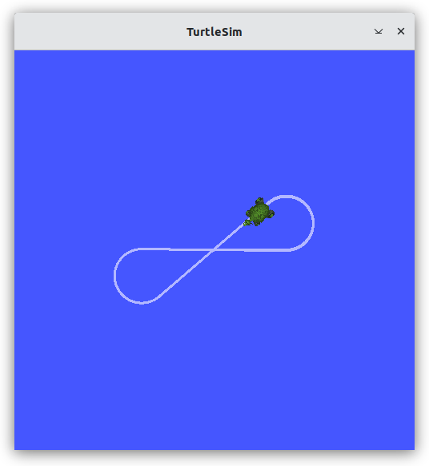
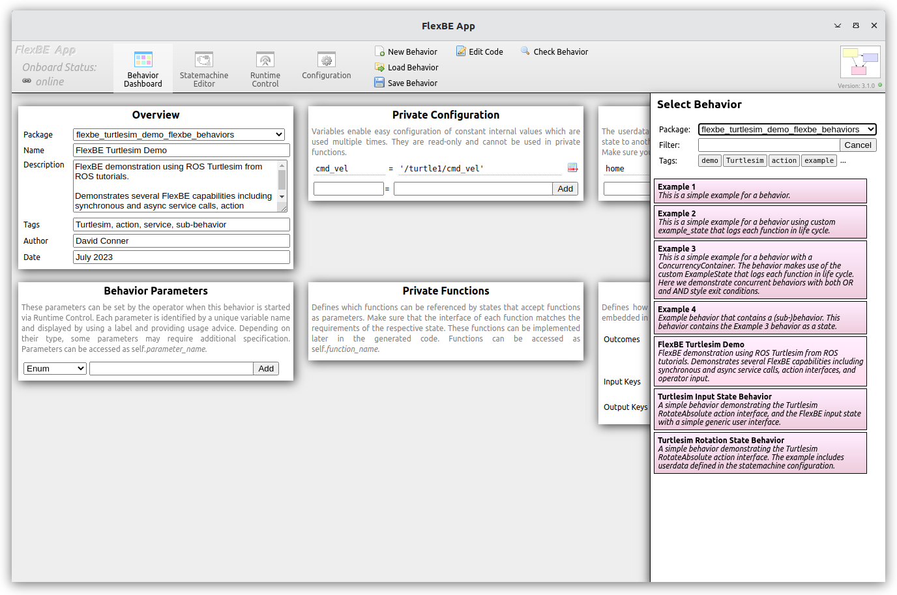
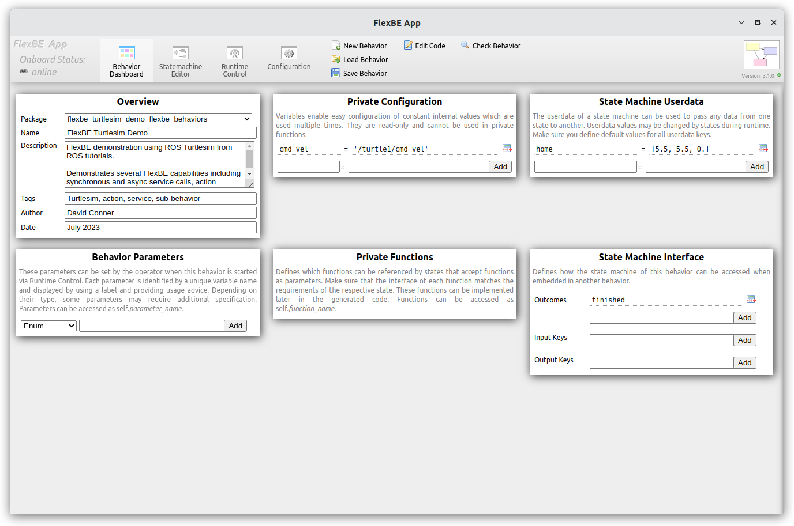
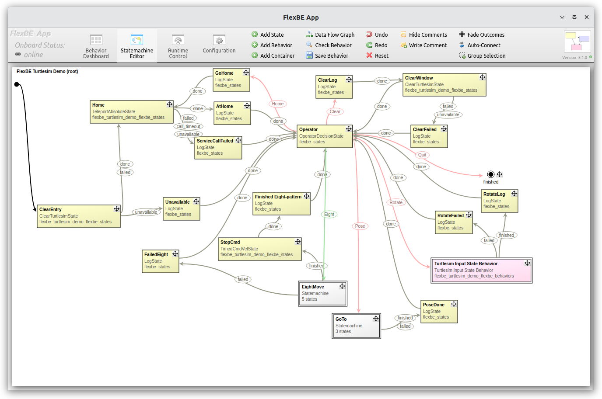
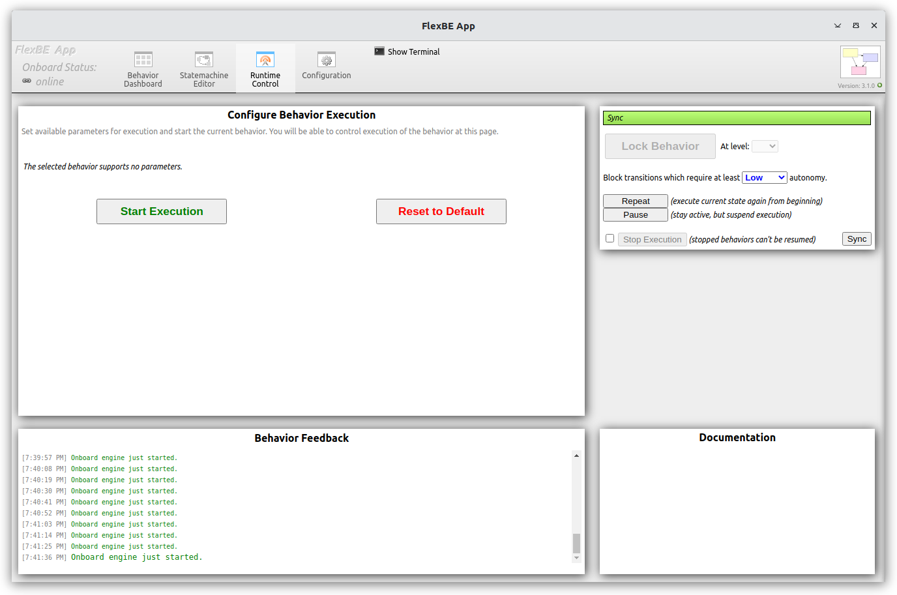
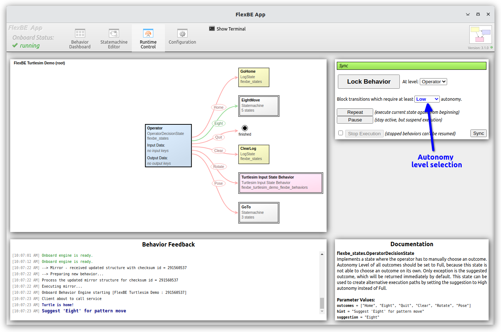
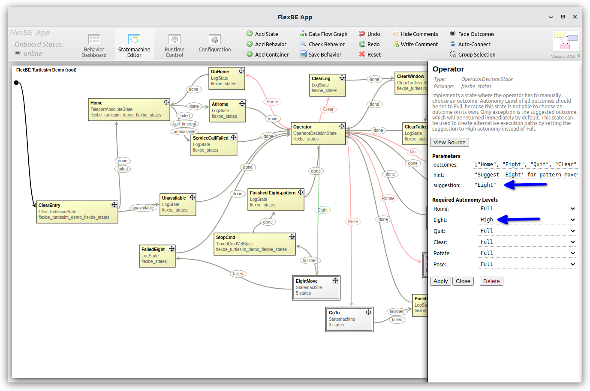
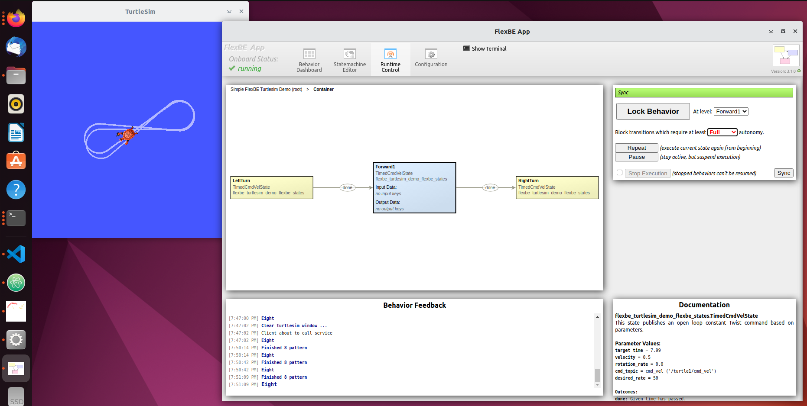

# Turtlesimを基にしたFlexbeのデモ

このリポジトリは、[Flexbe Turtlesim-based Demonstration](https://github.com/FlexBE/flexbe_turtlesim_demo)の日本語訳です。
ROS 2用のFlexBEのチュートリアルとして適切です。

----

このリポジトリでは、FlexBE 階層的有限ステートマシン（HFSM: Hierarchical Finite State Machine）ビヘイビアエンジンについて紹介します。
FlexBEには、*オンボードの* ロボット制御ビヘイビア実行部と、監視制御と協調的自律性のためのオペレータ制御ステーション(*OCS*: Operator Control Station)の両方を含んでいます。

このリポジトリは、全てがそろったFlexBEの入門書として、簡易な2D ROS Turtlesim [Turtlesim]シミュレータを基にした 「クイックスタート」を提供します。
リポジトリでは、flexbe_turtlesim_demo固有のステートとビヘイビアをすべて提供し、最小限のROSパッケージを使ってFlexBEの機能の簡単なデモンストレーションを提供します。

## チュートリアル例

以下に紹介するTurtlesimのデモに加え、このリポジトリには、FlexBEの使用方法と機能を説明するための詳細な[例](docs/examples.md)のステートとビヘイビアがいくつか含まれています。

----

## インストール

標準的なFlexBEの [flexbe_app](https://github.com/flexbe/flexbe_app/tree/ros2-devel) と
[flexbe_behavior_engine](https://github.com/flexbe/flexbe_behavior_engine/tree/ros2-devel) のパッケージに加えて、このリポジトリをあなたのROSワークスペースにクローンします。

`git clone https://github.com/flexbe/flexbe_turtlesim_demo.git`

ブランチが FlexBE App と Behavior Engine のインストールと一致していることを確認してください（例：`git checkout ros2-devel`）。

必要な依存関係をインストールしてください。

  * `rosdep update`
  * `rosdep install --from-paths src --ignore-src`

ワークスペースをビルドしてください。

  `colcon build`

ソースからFlexBEアプリをビルドする場合、FlexBEアプリを実行する*前に* `nwjs`のバイナリをダウンロードしてインストールする必要があります。

`ros2 run flexbe_app nwjs_install`

  > 注: これらは `install` フォルダにインストールされます。 
    もし `install` フォルダを削除した場合は、このスクリプトを使って `nwjs` バイナリを再インストールする必要があります。

----

FlexBE機能の詳細については、[例](docs/examples.md)を参照してください。

FlexBEの歴史と開発の詳細、およびビヘイビアの読み込みと起動の詳細については、メインの[FlexBE tutorials]を参照してください。

----

## クイック・スタート

Turtlesimノード、FlexBE UIアプリ、Flexible Behaviorエンジンを起動します。

各コマンドについて、ビルド後に端末で`setup.bash`を使用してROS環境が準備されているものと仮定します。

### 自律制御デモンストレーション

TurtleSimを起動します：

`ros2 run  turtlesim turtlesim_node`

> 注: `Gazebo` のようなシミュレータとは異なり、`TurtleSim` は ROS に `/clock` トピックをパブリッシュしません。 そのため、これらのデモでは `use_sim_time:=True` を設定しないでください！
> `/clock`がないと何もパブリッシュされないので、システムがハングアップしたように見えます；したがって、TurtleSim は実世界の時計(wallclock) の時刻を使用する必要があります。

以下を使用してFlexBEの *オンボード* システムを起動します。

`ros2 launch flexbe_onboard behavior_onboard.launch.py use_sim_time:=False`

完全自律モードでデモビヘイビアを開始します。

`ros2 run flexbe_widget be_launcher -b "FlexBE Turtlesim Demo" --ros-args --remap name:="behavior_launcher" -p use_sim_time:=False`

  これにより`FlexBE Turtlesim Demo`が起動し、完全自律モードで8の字パターンを生成するために一連の動作を通してカメを動かします。この例は、FlexBEを使用してオペレータの監視なしに完全に自律的にシステムを制御することを実証するもので、インストールしたものが正しく機能していることを確認する役割を果たします。

  

> 注：画像をクリックすると高解像度の画像が表示されます。

 システムが何周か動作するのを確認したら、`Ctrl-C`とだけ打ち`behavior_onboard`と`be_launcher`ノードを終了し、次のデモンストレーションへ移ります。

----

### FlexBEの協調的自律性のデモンストレーション

FlexBEの重要な設計目標は、オペレータ（またはオペレータのチーム）が状況の変化に応じてビヘイビアを監督し、修正することができる「協調的自律性」をサポートすることです。 協調的自律性についてのより多くの情報は[この論文](https://onlinelibrary.wiley.com/doi/full/10.1002/rob.21671)を参照してください。

`turtlesim` ノードが実行中で、グラフィックウィンドウが開いていることを確認してください。でなければ以下を入力します。

`ros2 run  turtlesim turtlesim_node`

オペレータが監視する自律ベースの制御のために、FlexBEの一式を起動するには、3つのアプローチがあります。
以下のアプローチの1つ（だけ）を使用してください。

#### 1) FlexBE クイックスタート

`ros2 launch flexbe_app flexbe_full.launch.py use_sim_time:=False`

  これにより、*OCS*と*オンボード*ソフトウェアの両方を含むFlexBEのすべてを1つの端末で開始します。

#### 2) *OCS*と*オンボード*を別々に起動する

`ros2 launch flexbe_onboard behavior_onboard.launch.py use_sim_time:=False`

`ros2 launch flexbe_app flexbe_ocs.launch.py use_sim_time:=False`

  これにより、*オンボード*ソフトウェアをロボット上で実行し、*OCS*ソフトウェアを別のマシンで実行することで、リモート監視が可能になります。

#### 3) FlexBEの各コンポーネントを別々の端末で起動する

##### *オンボード*

`ros2 launch flexbe_onboard behavior_onboard.launch.py use_sim_time:=False`
  * これはオンボードで実行され、HFSMのビヘイビアを動作させます。

##### *OCS*

`ros2 run flexbe_mirror behavior_mirror_sm --ros-args --remap __node:="behavior_mirror" -p use_sim_time:=False`
  * これはOCSコンピュータ上で実行され、`'flexbe/mirror/outcome'`トピックをリッスンし、ステート間の遷移を追いかけます。
    これにより、OCSはロボット上で起きていることを「ミラー」することができます。

`ros2 run flexbe_app run_app --ros-args --remap name:="flexbe_app" -p use_sim_time:=False`
  * これにより、FlexBEユーザーインターフェイスが起動します。

`ros2 run flexbe_widget be_launcher --ros-args --remap name:="behavior_launcher" -p use_sim_time:=False`
  * このノードはUIをリッスンし、ビヘイビア構造と開始リクエストをオンボードに送ります。
  * これはUIとは別に、起動時やリクエストを送ることでビヘイビアを起動するために使うこともできます。

*OCS*コンポーネントは、*オンボード*コンポーネントとは別のコンピュータで実行することができます。

これらの3つのアプローチのいずれかを使用してシステムを起動した後、主な対話はFlexBE UIを介して行われますが、
操作中に掲示される確認メッセージを見るために端末を監視することもできます。

#### オプションのオペレータ入力

以下のいくつかの（サブ）ビヘイビアはオペレータの入力を要求します。 このために、シンプルなポップアップダイアログウィンドウを
`flexbe_behavior_engine` リポジトリの `flexbe_input` パッケージの一部として提供します。

このオペレーター入力機能を使用するために、OCSコンピューター上で[`input_action_server`](https://github.com/FlexBE/flexbe_behavior_engine/blob/ros2-devel/flexbe_input/flexbe_input/input_action_server.py)を実行します。

`ros2 run flexbe_input input_action_server`

これは [`InputState`](https://github.com/FlexBE/flexbe_behavior_engine/blob/ros2-devel/flexbe_states/flexbe_states/input_state.py) と相互作用します。このシンプルな `input_action_server` デモは、数値や数値の`list`・`tuple` のような
限られたプリミティブな入力に対して基本的な機能を提供することを目的としています。

`InputState`の使い方についてのより多くの情報は、[Complex Data Input](docs/complex_data_input.md)を参照してください。

> 注： `InputState` は、 `pickle` モジュールを使用しているため、Pickleのマニュアルから以下の警告に従ってください。

>   警告 pickleモジュールは、誤ったデータや悪意を持って作成されたデータに対して安全ではありません。
>   信頼されていない、あるいは認証されていないソースから受信したデータは、決して復元（unpickle）しないでください。

`InputState`を使用する場合、信頼できないデータからネットワークを保護するのはユーザー次第です。

### FlexBEユーザーインターフェース（UI）によるビヘイビアの制御

FlexBE UIアプリケーションの*Behavior Dashboard*を使用して、上部中央のツールバーから*Load Behavior*を選択し、
ドロップダウンメニューから`flexbe_turtlesim_demo_flexbe_behaviors`パッケージと`FlexBE Turtlesim Demo`ビヘイビアを選択します。

> 注：ここでは、「ビヘイビア」という用語は、望ましいシステムビヘイビアを引き起こすステートマシンを意味します。
> 「ステート」という用語は、「ステートの実装」を定義するpythonクラスの特定のパラメータ化されたインスタンスを指すために使用します。

  
  
  

読み込まれたら、Behavior Dashboard（中央の画像）を使って、ビヘイビア全体の変数と入力を設定します。
この例では、カメのコマンドの速度と、カメの「ホーム」位置のトピックを指定しています。

*Statemachine Editor* タブは、既存のビヘイビアを検査または編集したり、新しいビヘイビアを作成したりするのに使います。
上の一番右の画像は`FlexBE Turtlesim Demo`のビヘイビアです。
FlexBEは、階層型有限ステートマシン（HFSM）をサポートしているため、「EightMove」ステートは、実際には、提供されたFlexBEステート実装を使用して8の字パターンを実行する単純なステートマシンの「コンテナ」であり、「Turtlesim Input State Behavior」は別の完全なビヘイビアのコンテナです。 これにより、ユーザーは他のビヘイビアをHFSMとして合成して複雑なビヘイビアを定義することができます。

このリポジトリの `flexbe_turtlesim_demo_flexbe_states` パッケージには、以下のPythonベースのカスタムなステートの実装が含まれています。

  * [`clear_turtlesim_state`](flexbe_turtlesim_demo_flexbe_states/flexbe_turtlesim_demo_flexbe_states/clear_turtlesim_state.py) - *ブロックする* サービスコールを使ってturtlesim ウィンドウをクリアする。
  * [`rotate_turtle_state`](flexbe_turtlesim_demo_flexbe_states/flexbe_turtlesim_demo_flexbe_states/rotate_turtle_state.py) - `action` インタフェースを使用して、ユーザが入力した角度にカメを回転させる。
  * [`teleport_absolute_state`](flexbe_turtlesim_demo_flexbe_states/flexbe_turtlesim_demo_flexbe_states/teleport_absolute_state.py) - *ブロックしない* サービスコールを使って、指定された位置に移動する。
  * [`timed_cmd_vel_state`](flexbe_turtlesim_demo_flexbe_states/flexbe_turtlesim_demo_flexbe_states/timed_cmd_vel_state.py) - 指定された更新レートを使用して、指令速度をパブリッシュする。

    > 注：指定のステート更新レートは、ベストエフォートでしかありません。 FlexBEはリアルタイムコントローラではなく、
    > 正確なタイミングを必要としない低レート（10～100Hz）の周期的なモニタリングに適しています。
  
例えば、[`timed_cmd_vel_state`](flexbe_turtlesim_demo_flexbe_states/flexbe_turtlesim_demo_flexbe_states/timed_cmd_vel_state.py)は、与えられた時間の間、一定の指令速度を[Twist](https://docs.ros2.org/latest/api/geometry_msgs/msg/TwistStamped.html)(前進速度と旋回速度)としてパブリッシュする`TimedCmdVelState`を実装しています。 `FlexBE Turtlesim Demo`のビヘイビアには、`EightMove`サブステートマシンコンテナが含まれています。 コンテナをダブルクリックするか、シングルクリックしてコンテナを開くようにリクエストして、そのコンテナを開くと、`TimedCmdVelState`の5つのステートのインスタンスが表示されます。 特定のパラメータ値は、FlexBE Editorにおいて特定のステートをクリックして設定します。「EightMove」ステートマシンと特定の 「LeftTurn」ステートの値を以下に示します。

  

その他のタイプのコンテナについては、詳細な[例](docs/examples.md)で説明しています。

----

*Runtime Control* タブでは、オンボードシステム上でビヘイビアを起動し、その実行をモニタすることができます。

  
  

8の字パターンを1周するために、「Eight」と書かれた遷移の楕円をクリックします。
完了すると、*Operator* ステートに戻ります。 

そこから以下を選択できます。

#### 選択可能な遷移

* [「Home」](docs/home_behavior.md) カメを中心に配置します。
* [「Clear」](docs/clear_behavior.md) 軌跡を消去します。
* [「Eight」](docs/eight_loop.md) 別のループを動かさせる。
* [「Rotate」](docs/rotate_behavior.md) オペレータが希望する角度を入力し、FlexBEの`userdata` を使ってそれを渡します。
* [「Pose」](docs/pose_behavior.md) オペレータが希望のポーズ位置を('[x, y]')として、または、ポーズを('[x, y, angle_in_radians]')として入力できるようにします。
* "Quit" ステートマシンのビヘイビアを完了し、ランタイム・コントロールを終了します。

上記の遷移名をクリックすると、そのサブビヘイビアの詳細ページにジャンプします。

「Full」自律性を選択すると、システムは自動的に「Eight」の遷移を自律的に繰り返すことを選ぶことができます。
以下に示すように、`OperatorDecisionState`の他の遷移は、 「Full」自律性を必要とするように設定されていますが、「Eight」は 「High」自律性しか必要としません。「Full」自律性モードでは、この 「Eight」の遷移が自動的に選択されます。
これはOCSなしで最初に示したモードです。

  
  

各遷移にリンクされている説明を読み、上記のさまざまなビヘイビアを練習してください。

## その他の例

FlexBEの理論と実装についてのより深い議論については、詳細な[例](docs/examples.md)を参照してください。

----

## TODO 以下を書き上げる

 * 実行中のビヘイビアへの「アタッチ」などの高度な操作について説明する。
 * FAQとデバッグの助け。
----

## 文献

FlexBEを使用する際には、参照のために以下の文献を使ってください：

- Philipp Schillinger, Stefan Kohlbrecher, and Oskar von Stryk, ["Human-Robot Collaborative High-Level Control with Application to Rescue Robotics"](http://dx.doi.org/10.1109/ICRA.2016.7487442), IEEE International Conference on Robotics and Automation (ICRA), Stockholm, Sweden, May 2016.

- Joshua Zutell, David C. Conner and Philipp Schillinger, ["ROS 2-Based Flexible Behavior Engine for Flexible Navigation ,"](http://dx.doi.org/10.1109/SoutheastCon48659.2022.9764047), IEEE SouthEastCon, April 2022.

-----
## 日本語訳のTODO

  * 画像の中の説明の英語も日本語にする。
  * オリジナルの間違いの修正をフィードバックする。

-----

[Turtlesim]:https://docs.ros.org/en/humble/Tutorials/Beginner-CLI-Tools/Introducing-Turtlesim/Introducing-Turtlesim.html
[FlexBE tutorials]:http://flexbe.github.io
