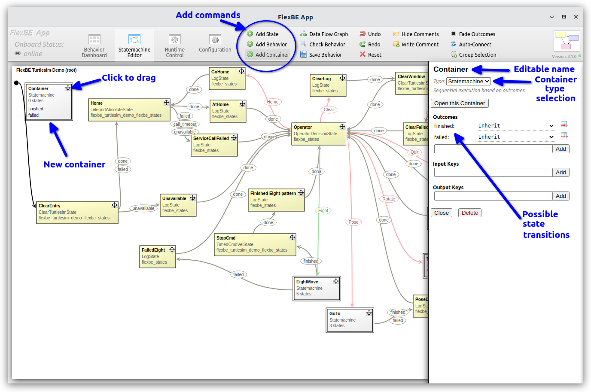

# Turtlesim Demo Figure 8 Loop Behavior

The "Eight" sub-behavior is implemented as an embedded state machine using 
a `StateMachine` container type in FlexBE.

New states -- including basic states, containers, and entire behaviors -- are added in the editor view.

<p float="center">
  
  
</p>

Here we demonstrate adding a new `State machine` container type to the existing state machine.

In the given `FlexBE Turtlesim Demo` behavior we added the container, then edited its name to be "EightMove" instead of "Container".

Inside the "EightMove" container, shown in the rightmost image above, we have defined a simple state machine that is just a sequence of 
[`TimeCmdVelState`](../flexbe_turtlesim_demo_flexbe_states/flexbe_turtlesim_demo_flexbe_states/timed_cmd_vel_state.py) instances.


```python
rom rclpy.duration import Duration
from flexbe_core import EventState, Logger
from flexbe_core.proxy import ProxyPublisher

from geometry_msgs.msg import Twist

class TimedCmdVelState(EventState):
    """
    This state publishes an open loop constant Twist command based on parameters.

    -- target_time          float     Time which needs to have passed since the behavior started.
    -- velocity             float     Body velocity (m/s)
    -- rotation_rate        float     Angular rotation (radians/s)
    -- cmd_topic            string    Topic name of the robot velocity command (default: 'cmd_vel')
    -- desired_rate         float     Desired state update rate (default: 50 Hz)
    <= done                 Given time has passed.
    """

    def __init__(self, target_time, velocity, rotation_rate, cmd_topic='cmd_vel', desired_rate=50):
        """Declare outcomes, input_keys, and output_keys by calling the super constructor with the corresponding arguments."""
        super().__init__(desired_rate=desired_rate, outcomes=['done'])

        # Store state parameter for later use.
        self._target_time = Duration(seconds=target_time)

        # The constructor is called when building the state machine, not when actually starting the behavior.
        # Thus, we cannot save the starting time now and will do so later.
        self._start_time = None

        self._return = None  # Track the outcome so we can detect if transition is blocked

        self._twist = Twist()
        self._twist.linear.x = velocity
        self._twist.angular.z = rotation_rate
        self._cmd_topic = cmd_topic

        # FlexBE uses "proxies" for publishers, subscribers, and service callers
        # so that all states in a behavior can share a single subscription/publisher
        ProxyPublisher.initialize(TimedCmdVelState._node)  # the class must know the behavior node
        self._pub = ProxyPublisher()
        self._pub.createPublisher(cmd_topic, Twist)

    def execute(self, userdata):
        """Call this method periodically while the state is active."""
        if self._return:
            # We have completed the state, and therefore must be blocked by autonomy level
            # Stop the robot, but and return the prior outcome
            if self._cmd_topic:
                self._pub.publish(self._cmd_topic, Twist())

            return self._return

        if self._node.get_clock().now().nanoseconds - self._start_time.nanoseconds > self._target_time.nanoseconds:
            # Normal completion, do not bother repeating the publish
            # We won't bother publishing a 0 command unless blocked (above)
            # so that we can chain multiple motions together
            self._return = 'done'
            Logger.localinfo(f"{self._name} : returning 'done'")  # For initial debugging
            return 'done'

        # Normal operation
        if self._cmd_topic:
            Logger.localinfo(f"{self._name} : {self._twist}")  # For initial debugging
            self._pub.publish(self._cmd_topic, self._twist)

        return None

    def on_enter(self, userdata):
        """
        Call this method when the state becomes active.

        i.e. a transition from another state to this one is taken.
        """
        self._start_time = self._node.get_clock().now()
        self._return = None  # reset the completion flag
```

The `TimedCmdVelState` stores the start time `on_enter` and the published the specified command velocity to the 
designated topic at *approximately* the desired update rate.  Again, FlexBE is best effort on timing and depends on 
the operating system and other processes.  It is *NOT* a guaranteed realtime controller.

All of the state machine implementation code in [`flexbe_turtlesim_demo_sm.py`](../flexbe_turtlesim_demo_flexbe_behaviors/flexbe_turtlesim_demo_flexbe_behaviors/flexbe_turtlesim_demo_sm.py) is generated by the FlexBE UI when the behavior is saved.

In this case, as shown in the fragment below, the code creates an instance (called `_sm_eightmove_1`) of the [`OperatableStateMachine`](https://github.com/FlexBE/flexbe_behavior_engine/blob/ros2-devel/flexbe_core/flexbe_core/core/operatable_state_machine.py) from FlexBE Core 
 and `add`s the "LeftTurn" instance of `TimedCmdVelState` (among others), then adds the `_sm_eightmove_1` instance to the top-level state machine `_state_machine`.  This is the way FlexBE composes states to implement the HFSM concept.


```python
        # x:975 y:134, x:130 y:365
        _sm_eightmove_1 = OperatableStateMachine(outcomes=['finished', 'failed'])

        with _sm_eightmove_1:

            # x:179 y:211
            OperatableStateMachine.add('LeftTurn',
                                       TimedCmdVelState(target_time=5.77, velocity=0.5, rotation_rate=0.667,
                                                        cmd_topic=cmd_vel, desired_rate=50),
                                       transitions={'done': 'Forward1'},
                                       autonomy={'done': Autonomy.Off})

        with _state_machine:

            # x:654 y:490
            OperatableStateMachine.add('EightMove',
                                       _sm_eightmove_1,
                                       transitions={'finished': 'StopCmd', 'failed': 'FailedEight'},
                                       autonomy={'finished': Autonomy.Inherit, 'failed': Autonomy.Inherit})

```

The parameters in the various states -- "Forward0", "LeftTurn", "Forward1", "RightTurn", and "Forward2" -- were calculated to generate the basic figure 8 pattern demonstrated. Note, these are purely open loop motions and do not make any adjustment to stay in bounds or avoid other turtles you may choose to spawn in the `turtlesim` node.

When the operator clicks the "Eight" transition, or if automatically selected in "Full" autonomy, the "EightMove" state machine becomes
the active state from the point of view of the top-level (or "root") state machine, `on_enter`ing the "EightMove" state, the initial "Forward0" state is activated, and becomes the active state being executed by the behavior engine.  The "EightMove" state remains active until the "Forward2" state returns "done", at which point "EightMove" returns the outcome "finished".

> Note: A "failed" outcome for "EightMove" was initially defined, but was never connected internally.
> Regardless, since it was defined, it must be connected at the root level.  This allows for future modification.
> FlexBE requires all possible state outcomes to be terminated, even if they are never exercised.
> Alternatetively, the "failed" outcome could be deleted in the editor view of "EightMove" by clicking the box with red line to right of outcome label.


----

This example has demonstrated construction of an HFSM using a state machine container.

[Back to the overview](../README.md#selectable-transitions)

