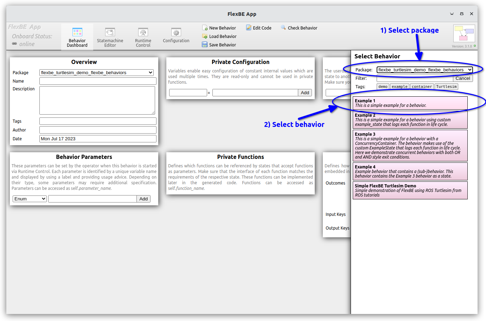
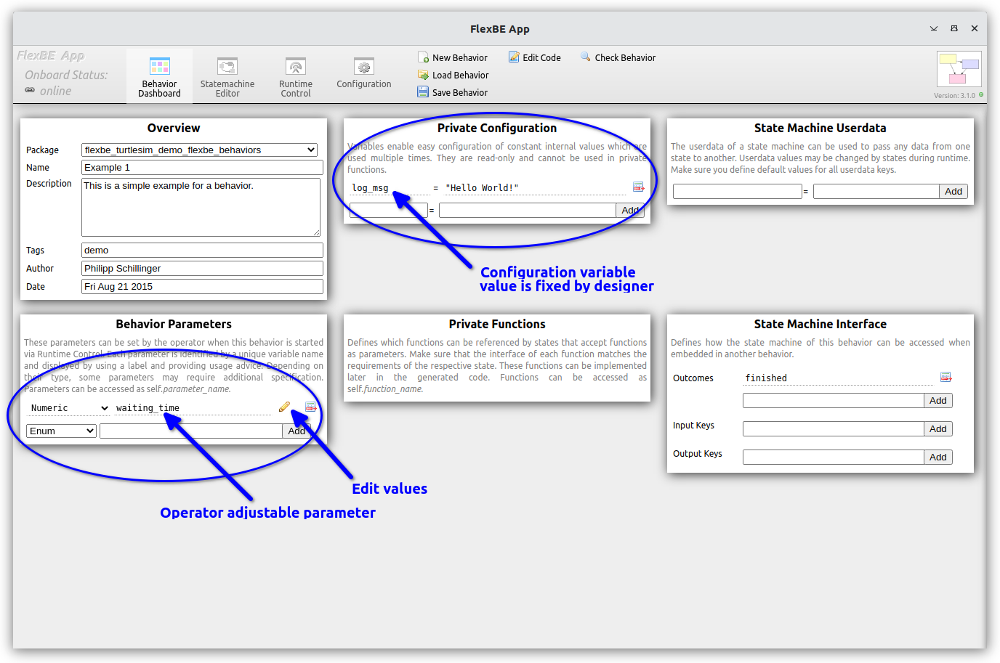
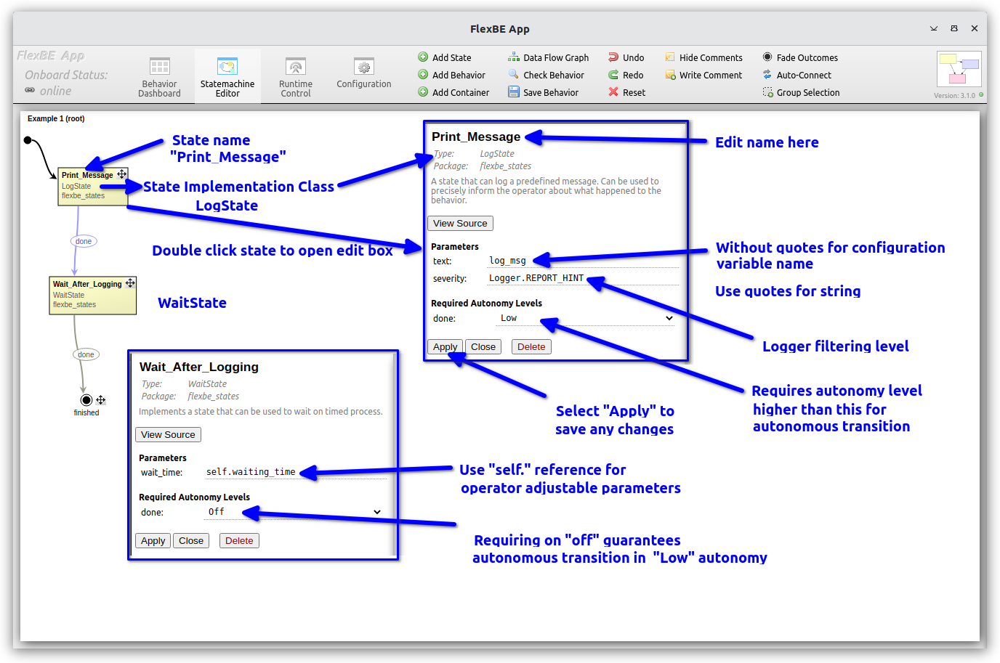
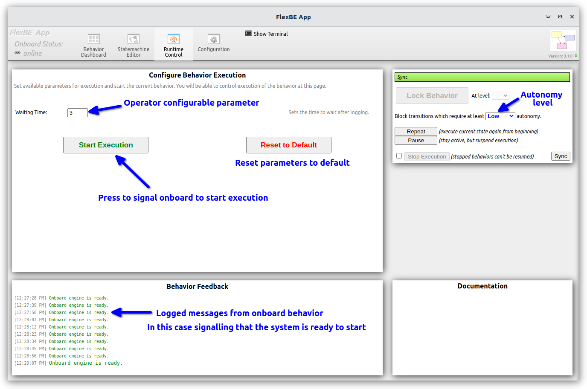
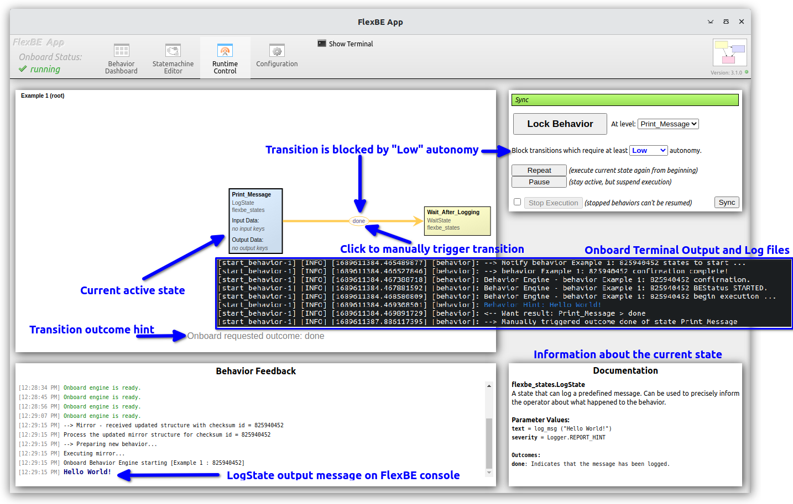
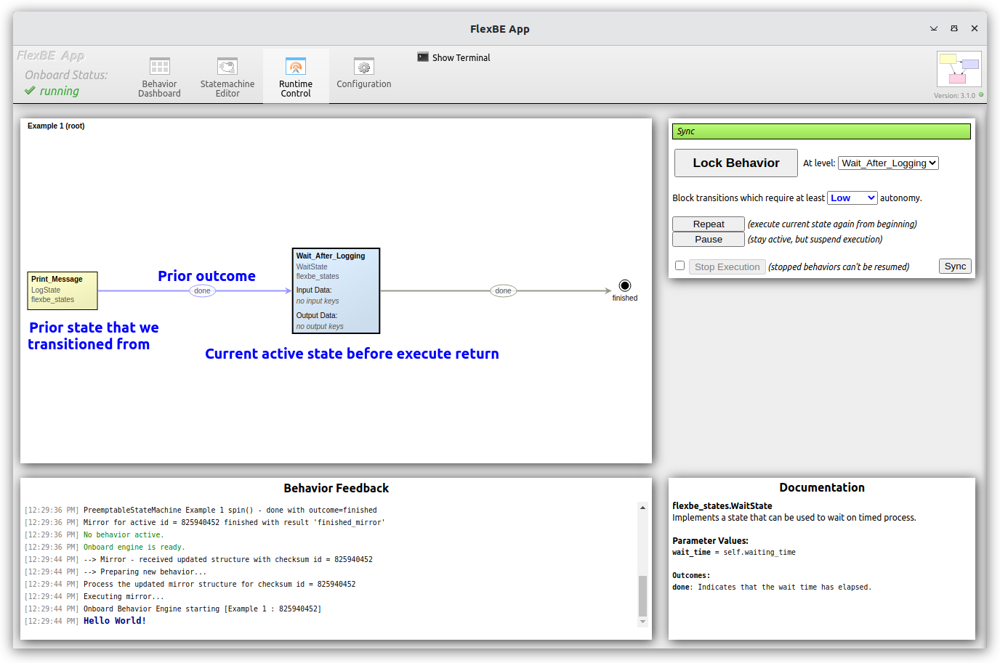

# Example 1 - Simple State Machine using FlexBE states

The first behavior, `Example 1`, constructs a simple state machine
using two states provided with the FlexBE Behavior Engine.

After starting the FlexBE system using either  

`ros2 launch flexbe_app flexbe_full.launch.py use_sim_time:=False`

or the individual components

  `ros2 launch flexbe_onboard behavior_onboard.launch.py use_sim_time:=False`

  `ros2 run flexbe_mirror behavior_mirror_sm --ros-args --remap __node:="behavior_mirror" -p use_sim_time:=False`

  `ros2 run flexbe_app run_app --ros-args --remap name:="flexbe_app" -p use_sim_time:=False`

  `ros2 run flexbe_widget be_launcher --ros-args --remap name:="behavior_launcher" -p use_sim_time:=False`

Load the `Example 1` behavior from the FlexBE UI dashboard as shown in the leftmost image below.  Once loaded,
the "Behavior Dashboard" shows the behavior configuration information as shown in the center image below.
For this behavior, an operator settable "parameter" `waiting_time` is defined, along with a constant private configuration 
variable `log_msg`.  In the upper left, the "Overview" pane provides the name of the behavior "Example 1", a description and author 
information.  The behavior name is converted into the implementation Python file name, `example_1_sm.py` and class name `Example1SM`.
In addition to the Python file, a "behavior manifest" `example_1.xml` is written as well.

<p float="center">
  
  
  
</p>

FlexBE Behavior editor view for "Example 1" behavior.  Click on any image to see the high resolution annotated versions.

The "Statemachine Editor" tab allows one to view the existing state machine that we have loaded, as shown in the rightmost image above.
One could edit and save the state machine, but for now we will just explore.  By double clicking on a state, a state property edit box is opened, as shown in the outlined callouts above.  

Example 1 uses a standard FlexBE `LogState`(https://github.com/FlexBE/flexbe_behavior_engine/blob/ros2-devel/flexbe_states/flexbe_states/log_state.py) and a `WaitState`(https://github.com/FlexBE/flexbe_behavior_engine/blob/ros2-devel/flexbe_states/flexbe_states/wait_state.py) state implementation show below.

The log state is one of the simplest FlexBE state implementations.
```python
from flexbe_core import EventState, Logger


class LogState(EventState):
    """
    A state that can log a predefined message.

    Can be used to precisely inform the operator about what happened to the behavior.

    -- text      string  The message to be logged to the terminal.
    -- severity  uint8   Type of logging (Logger.REPORT_INFO / WARN / HINT / ERROR)

    <= done     Indicates that the message has been logged.
    """

    def __init__(self, text, severity=Logger.REPORT_HINT):
        super(LogState, self).__init__(outcomes=['done'])
        self._text = text
        self._severity = severity

    def execute(self, userdata):
        # Already logged. No need to wait for anything.
        return 'done'

    def on_enter(self, userdata):
        """Log upon entering the state."""
        Logger.log(self._text, self._severity)
```

The state implementation is a Python script that provides the
actual execution of the state. In this example, we import the FlexBE Logger class, which is used to which prints
a message in the onboard terminal, the standard FlexBE log file, and on the operators FlexBE UI.  
The `__init__` parameters `text` and `severity` are shown in the state property edit box as shown in the rightmost image above.
The possible outcome `done` is likewise shown, and the editor allows one to set a required autonomy level for autonomous transition.

The state implementation must be defined by super classing the [`EventState`]:(https://github.com/FlexBE/flexbe_behavior_engine/blob/ros2-devel/flexbe_core/flexbe_core/core/event_state.py)
class provided by FlexBE in the `flexbe_core` package.

The Python doc-string in the `"""`-marks provides information
about the state, and is used by the UI to display information about the data handling.  Special indicators are used for different data.

* `--` denote parameters defined in the `__init__`
  * In this case `text` and `severity` are specified on construction.
* `<=` denotes possible outcomes of the state
  * In this case, only `done` is a possible outcome
  * This information must match the `outcomes=['done']` specified in the `EventState` `super().__init__` method call.

Although, not shown in this example, other UI specifications include:
* `>#` - data passed as input `userdata` from upstream states
* `#>` - data passed as output `userdata` to downstream states

> Note: Userdata can also be defined at the state machine level.

The `LogState` includes two methods: `on_enter` and `execute`.
The `on_enter` method is called when the state is first entered via a transition.  In this case, the state uses the `Logger`
class to log the data to terminal, log file, and FlexBE UI.

The `execute` method is invoked at a specified rate until is returns something other than `None`.
It is expected (and enforced at run time), that the returned values are as specified as valid (e.g. `done` in this case).
For the `LogState` the execute function immediately returns `done` as there is nothing more to do.

Our second state is the `WaitState`(https://github.com/FlexBE/flexbe_behavior_engine/blob/ros2-devel/flexbe_states/flexbe_states/wait_state.py) state implementation show below.

```python
from flexbe_core import EventState


class WaitState(EventState):
    """
    Implements a state that can be used to wait on timed process.

    -- wait_time  float  Amount of time to wait in seconds.

    <= done       Indicates that the wait time has elapsed.
    """

    def __init__(self, wait_time):
        super(WaitState, self).__init__(outcomes=['done'])
        self._wait = wait_time

    def execute(self, userdata):
        elapsed = WaitState._node.get_clock().now() - self._start_time
        if elapsed.nanoseconds * 10 ** -9 > self._wait:
            return 'done'

        return None

    def on_enter(self, userdata):
        """Upon entering the state, save the current time and start waiting."""
        self._start_time = WaitState._node.get_clock().now()
```

The `wait_time` parameter says hown long to wait after entering the state before returning.
This provides a simple delay within the state machine.
This state also has only one outcome `done`.
As shown in the rightmost image above, the `Wait_after_logging` named state instance of the `WaitState` implementation 
sets the `wait_time` parameter to use the operator settable parameter `self.waiting_time`

After exploring these views, move to the "Runtime Control" tab of the FlexBE UI.

The leftmost image below shows the initial view prior to executing the behavior.  The operator can adjust the 
`wait_time` parameter value (currently 3 seconds) here, and set the initial supervised autonomy level.  In this case 
we block any transitions that required anything higher than "Off".

> Note:  For this behavior, the `wait_time` was initially configured as `3` without a decimal point.  
> This will require an integer value as input.  To allow for floating point values, specify with a decimal point (e.g., `3.`).

The center image shows the initial `Print_Message` state with the output  blocked due to the required autonomy level.  
The system requests the operator to click on "done" transition in the oval label to enable the transition to next state.
The "Behavior Feedback" pane shows output logged from the onboard behavior, including the "Hello World!" message originally 
defined on the configuration screen.  This message is also logged on the onboard terminal window where the onboard node was started.
After clicking on the "done" transition, the current active state transitions to the `Wait_After_Logging" state as shown in the rightmost
image below.  As this is during the wait period the output transition is shown in gray, whereas the center image shows the transition that is active highlighted in yellow.  The operator can wait for the state to finish, or can choose to preempt the state and force the "done" transition by clicking on the label oval prior to the wait time completing.  Because this state has "Off" autonomy level, the behavior will autonomously complete and return outcome "finished" as it returns to the "Start" pane shown in the leftmost image.


<p float="center">
  
  
  
</p>

For the next run, try setting the autonomy level higher to "High" or "Full", which will allow the behavior to run to completion without the operator needed to click "done" after the log state.

After this, continue on to [Example 2](docs/example2.md) for a more indepth discussion of the state implementations.

