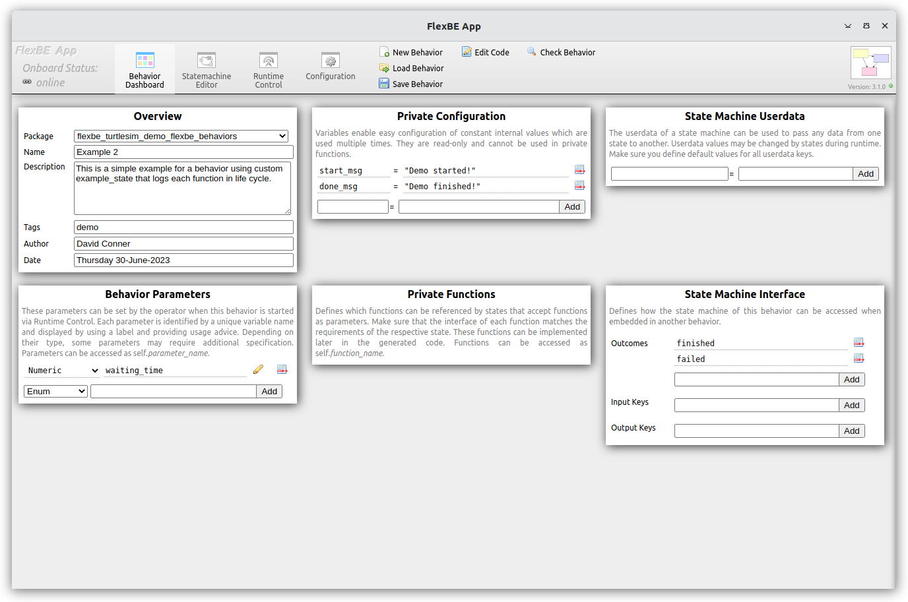
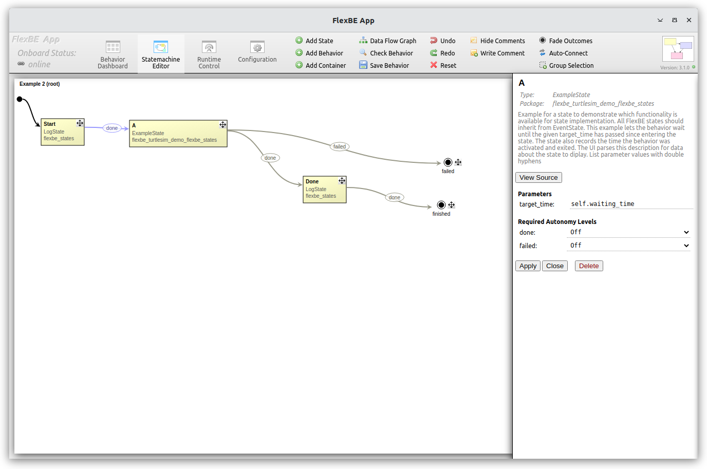
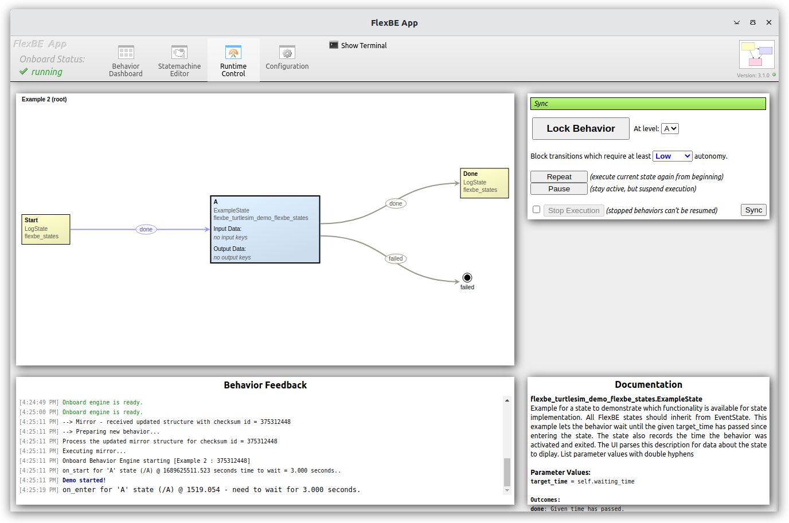
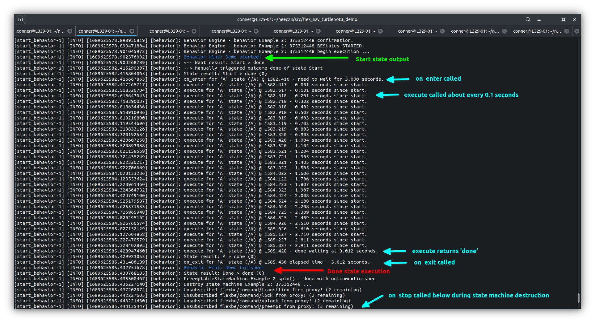
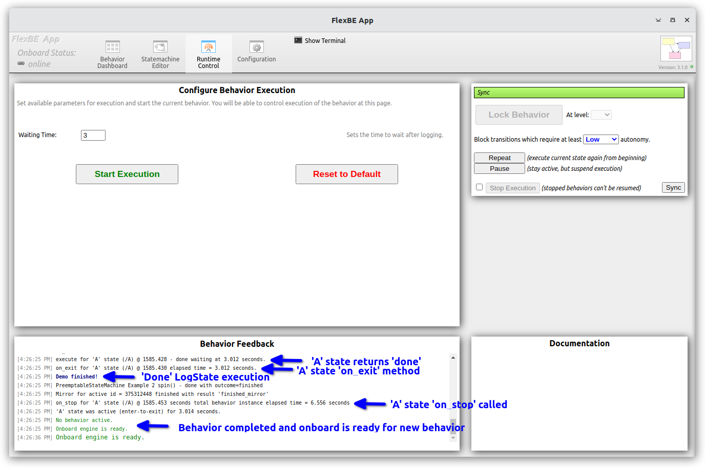

# Example 2 - State Implementation Life Cycle

The `Example 2` behavior constructs a simple state machine
using three states.

After starting the FlexBE system, load the `Example 2`
behavior from the FlexBE UI dashboard.  The leftmost image below shows the 
configuration dashboard after loading, and the center image shows the state machine with the 
`ExampleState` properties shown.  The rightmost image shows the state machine after entering 
the `A` example state. 

> Note: In low autonomy, you must click the `done` transition after the `Start` state to manually 
> transition to the `A` state as the transition is blocked due to autonomy level.

<p float="center">
  
  
  
</p>

In addition to the `LogState` from `Example 1`, this behavior uses the `ExampleState` provided as part of this repo in 
`flexbe_turtlesim_demo_flexbe_states`.  You are free to develop your own FlexBE state implementations that inherit from
`EventState`.  To let FlexBE find your states implementations,
write them as a normal ROS 2 installed Python script, and specify
that the package `export`s `<flexbe_states />`.
```xml
<export>
    <build_type>ament_python</build_type>
    <flexbe_states />
</export>
```

Our [`ExampleState`](flexbe_turtlesim_demo_flexbe_states/flexbe_turtlesim_demo_flexbe_states/example_state.py) specifies one parameter (`target_time`) and two outputs (`'done'` and `'failed'`).  
This example does NOT use `userdata`.

```
List parameter values with double hyphens
-- target_time     float     Time which needs to have passed since the behavior started.

List labeled outcomes using the double arrow notation (must match constructor)
<= done            Given time has passed.
<= failed          Example for a failure outcome.
```

These are specified in the `__init__` method, along with needed instance variables.

```python
def __init__(self, target_time):
    """Declare outcomes, input_keys, and output_keys by calling the super constructor with the corresponding arguments."""
    super().__init__(outcomes=['done', 'failed'])

    # Store state parameter for later use.
    self._target_wait_time = Duration(seconds=target_time)

    # The constructor is called when building the state machine, not when actually starting the behavior.
    # Thus, we cannot save the starting time now and will do so later.
    self._state_start_time = None
    self._state_enter_time = None
    self._state_exit_time = None

    self._elapsed_time = Duration(nanoseconds=2**63 - 1)
```

This state is tasked with waiting for the specified time after entering the state before returning done.  This state specifies
two possible outcomes, but only one is actually achievable with this code as we do not anticipate actually encountering the failed case 
with this demo.
We define other instance attributes to hold data.

The state lifecycle follows:
* `on_start` - the behavior and all sub-states are instantiated
  * Use this to initialize things that should be started up
  with the overall behavior.  This method is called after construction, but is separate from the `__init__` construction.

* `on_enter` - the state becomes active after upstream transition
* `execute` - called repeatedly until something other than a Python `None` value is returned
  * Each "tic" of the `execute` method is periodic; a desired update tic rate value can be specified at both the state machine level and individual states if so desired. A default rate of 10Hz is used, but the overall desired value is set in the state machine configuration tab (discussed later).

  > Note: In FlexBE, the tic rate is "best effort" and there are no real time performance guarantees.

* `on_exit` is called once when the state returns something other than `None` from `execute`.
* `on_stop` is called when the behavior is shutdown.

Only an `execute` function is required to be overridden so that
the state can return a value an terminate the state operation.
The other methods can be overridden, or left as their default `pass` values from `EventState`.  At some point, the `enter` method should return a value other than `None` otherwise the state executes forever.

The [`ExampleState`](flexbe_turtlesim_demo_flexbe_states/flexbe_turtlesim_demo_flexbe_states/example_state.py) overrides all of the methods, and adds logging to each transition to show how the the system executes each method during the state lifecycle.

```python
def on_enter(self, userdata):
    self._state_enter_time = ExampleState._node.get_clock().now()
    self._elapsed_time = Duration(seconds=0.0)
    self._return = None  # Clear return code on entry

    Logger.loginfo(f"on_enter for '{self._name}' state ({self.path}) @ {self.clock_time} "
                       f"- need to wait for {self.target_seconds} seconds.")

def on_exit(self, userdata):
    self._state_exit_time = ExampleState._node.get_clock().now()
    Logger.loginfo(f"on_exit for '{self._name}' state ({self.path}) @ {self.clock_time} "
                   f"elapsed time = {self.elapsed_seconds} seconds.")

def on_start(self):
    self._state_start_time = ExampleState._node.get_clock().now()
    Logger.loginfo(f"on_start for '{self._name}' state ({self.path}) @ {self.start_time} seconds "
                   f" time to wait = {self.target_seconds} seconds..")

def on_stop(self):
    self._elapsed_time = ExampleState._node.get_clock().now() - self._state_start_time
    Logger.loginfo(f"on_stop for '{self._name}' state ({self.path}) @ {self.clock_time} seconds "
                   f" total behavior instance elapsed time = {self.elapsed_seconds} seconds ")
    if self._state_enter_time is None:
        Logger.loginfo(f"on_stop for '{self._name}' state ({self.path}) @ {self.clock_time} seconds "
                   f" - never entered the state to execute! ")
    else:
        try:
            self._elapsed_time = self._state_exit_time - self._state_enter_time
            Logger.loginfo(f"    '{self._name}' state "
                        f"was active (enter-to-exit) for {self.elapsed_seconds} seconds.")
        except Exception as exc:  # pylint: disable=W0703
            Logger.logerr(f"  entered at time={self.enter_time} seconds but never exited!")
```

The `Logger.loginfo` (and `logwarn`, `logerr`, `logdebug`) log messages to the `.ros/log` file, the onboard terminal, and the FlexBE UI.

In this particular example state, we also provide several
helper property methods to assist in data logging:

```python
@property
def elapsed_seconds(self):
    return f"{self._elapsed_time.nanoseconds/S_TO_NS:.3f}"

@property
def target_seconds(self):
    return f"{self._target_wait_time.nanoseconds/S_TO_NS:.3f}"

@property
def start_time(self):
    return f"{self._state_start_time.nanoseconds/S_TO_NS:.3f}"

@property
def enter_time(self):
    return f"{self._state_enter_time.nanoseconds/S_TO_NS:.3f}"

@property
def exit_time(self):
    return f"{self._state_exit_time.nanoseconds/S_TO_NS:.3f}"

@property
def clock_time(self):
    time_msg = self._node.get_clock().now().to_msg()
    time = time_msg.sec % 3600 + time_msg.nanosec/S_TO_NS
    return f"{time:.3f}"
```
Your state implementations are free to define additional helper methods as needed.

A few key points:
* The `EventState` super class maintains a reference to the ROS `node` of the behavior.  Here we use the `_node` attribute get the ROS clock instance.
* Normal Python constructs including `for`-loops, `if-else`, and
`try-except` blocks are valid within these methods with a few caveats:
* Only `execute` should return a value
* States should be fast acting "reactive" states.
    * Offload longer running processes, such as planning, to separate nodes and preferably interface using regular `topics` and `actions`
* Again, these methods should *NOT* be long `blocking` calls.  

> Note: While blocking calls are possible, prefer to use non-blocking calls such as `actions` or asychronous service calls.  
See the TurtleSim demo discussions for ["Home"](home_behavior.md), ["Clear"](clear_behavior.md), and ["Rotate"](rotate_behavior.md) 
for more information about `action` and `service` handling.


The [`ExampleState`](flexbe_turtlesim_demo_flexbe_states/flexbe_turtlesim_demo_flexbe_states/example_state.py) `execute` function monitors the time since `on_enter`, and returns `done` when the *approximate* time has elapsed based on the designated update rate.

```python
def execute(self, userdata):
    """
    Execute this method periodically while the state is active.

    Main purpose is to check state conditions and trigger a corresponding outcome.
    If no outcome is returned, the state will stay active.
    """
    if self._return is not None:
        # We must be blocked by autonomy level.
        # Here we will just return the prior outcome and not recalculate

        # Local info is NOT sent to the UI, and only shown in logs and terminal
        Logger.localinfo(f"execute blocked for '{self._name}' state ({self.path}) @ {self.clock_time} "
                    f"- use prior return code={self._return}")
        return self._return

    # Normal calculation block
    try:
        self._elapsed_time = ExampleState._node.get_clock().now() - self._state_enter_time
        if self._elapsed_time >= self._target_wait_time:
            Logger.loginfo(f"execute for '{self._name}' state ({self.path}) @ {self.clock_time} "
                           f"- done waiting at {self.elapsed_seconds} seconds.")
            self._return = 'done'
            return 'done'  # One of the outcomes declared above.
    except Exception:  # pylint:disable=W0703
        # Something went wrong
        Logger.logerr(f"execute for '{self._name}' state ({self.path}) @ {self.clock_time} "
                       f"- something went wrong after {self.elapsed_seconds} seconds.")
        self._return = 'failed'
        return 'failed'

    # Local info is NOT sent to the UI, and only shown in logs and terminal
    Logger.localinfo(f"execute for '{self._name}' state ({self.path}) @ {self.clock_time} "
                    f"- {self.elapsed_seconds} seconds since start.")
    return None  # This is normal behavior for state to continue executing
```

A few key points about the `execute` method:
* We track any previous `_return` value in case the operator has the exit transition blocked due to an autonomy
level.  
If the transition is blocked, the state continues to call `execute`.  
So, the state designer can choose to re-do the execute, or just return
the previous value depending on the specific implementation
 design.  This flexibility is left to the state developer.  
But, be aware that the the `execute` is called if a transition is blocked.
We will guide you through this later in the example demonstration.
* This example includes a significant amount of logging to console; this is
atypical, especially in an execute block, as it slows the system down due to the computational cost of I/O.
* The code demonstrates one possible use of exception handling and returning a `failed` outcome,
although we do not expect this block to be exercised in this example.

Now, start the execution in `Low` autonomy.

During normal execution, the `Logger.localinfo` method call above only logs to the `.ros/log` file and onboard terminal, it does NOT send 
a message to the FlexBE UI.  Thus, only the final return values are shown at the FlexBE console.  The leftmost image 
below shows the onboard terminal output as the execute method continues to be called until the final return value, then `on_exit`
is called.  As the required autonomy level for this outcome is `off`, the system exits the behavior and `on_stop` is called for all
states.  The rightmost image shows the final output on the FlexBE UI as after the behavior completes and the system is ready for more.

<p float="center">
  
  
</p>

For the next run, try setting the autonomy level higher to "High" or "Full", which will allow the behavior to run to completion without the operator needed to click "done" after the log state, or to "Off" which will require the operator to confirm every transition.

Also try to force early transitions by clicking on the transition label oval.  Try editing the state machine and modifying the configuration messages or wait times on the dashboard.  You will need to resave the behavior.  

> Note: Currently behaviors are saved under the workspace `install` folder of the OCS machine.  
> These changes are not visible in the source folder, and will be lost if the package is rebuilt.
> To save any changes, the updated behavior Python and xml manifest files must be copied to the source folder.

After experimenting with `Example 2`, continue on to [Example 3](docs/example3.md) for a look at our first Hierarchical Finite State Machine (HFSM) using a `ConcurrencyContainter` that executes states in "parallel".

