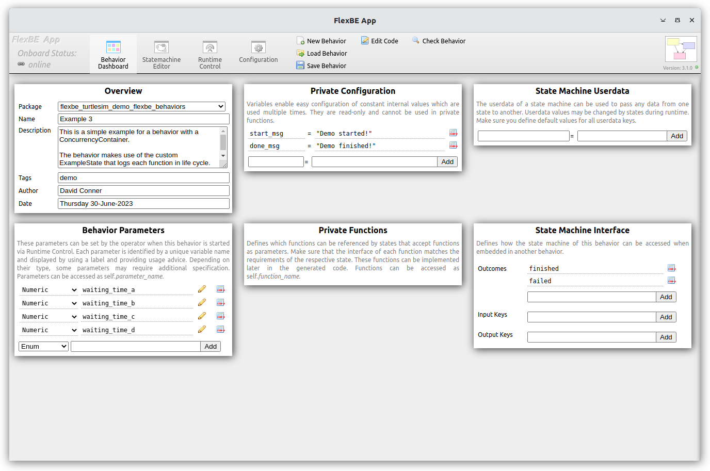
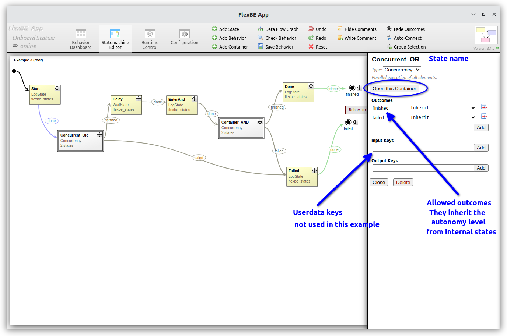
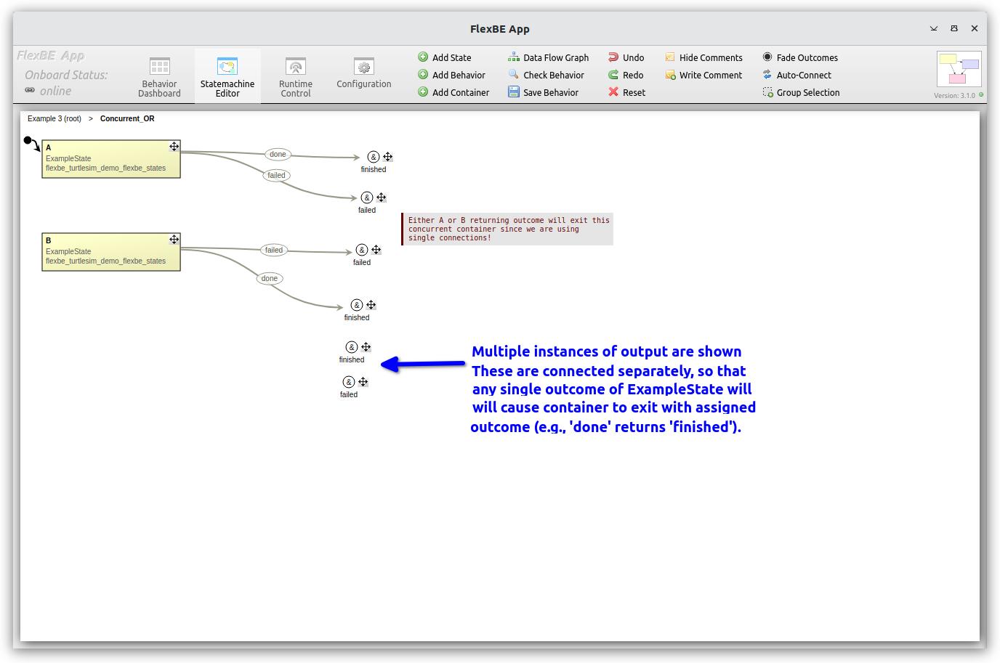
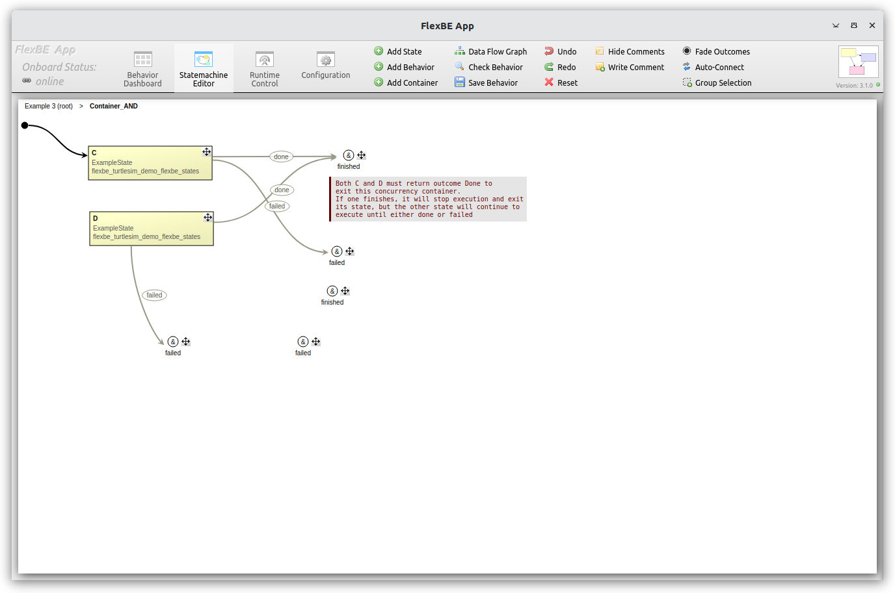
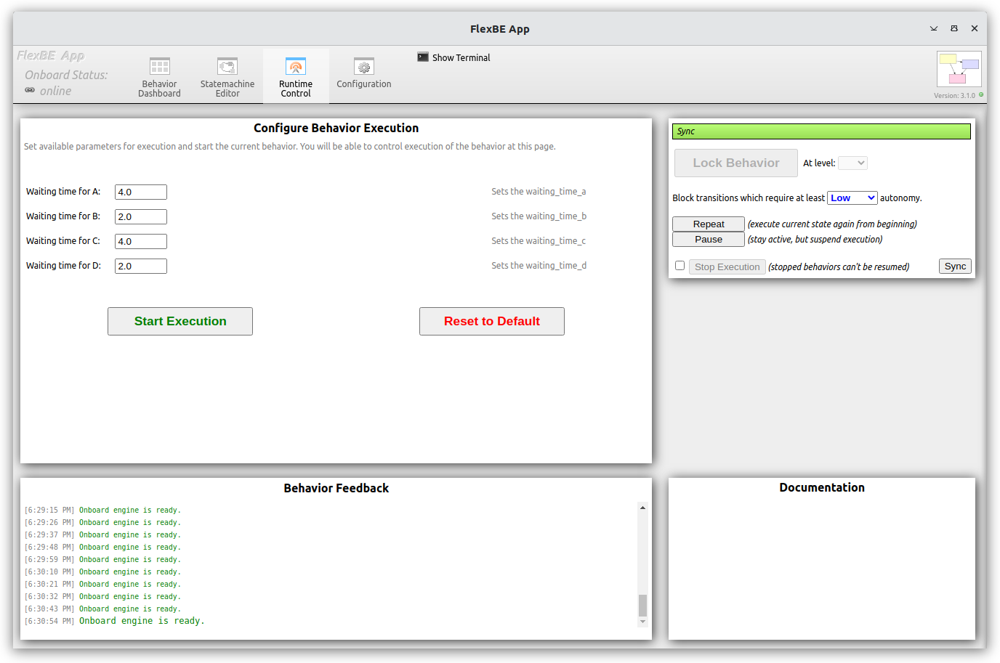
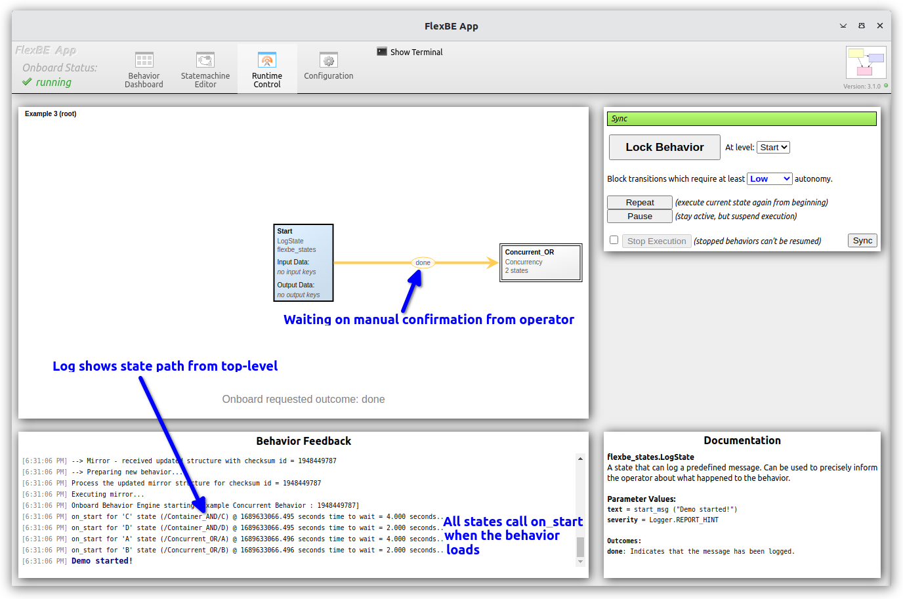
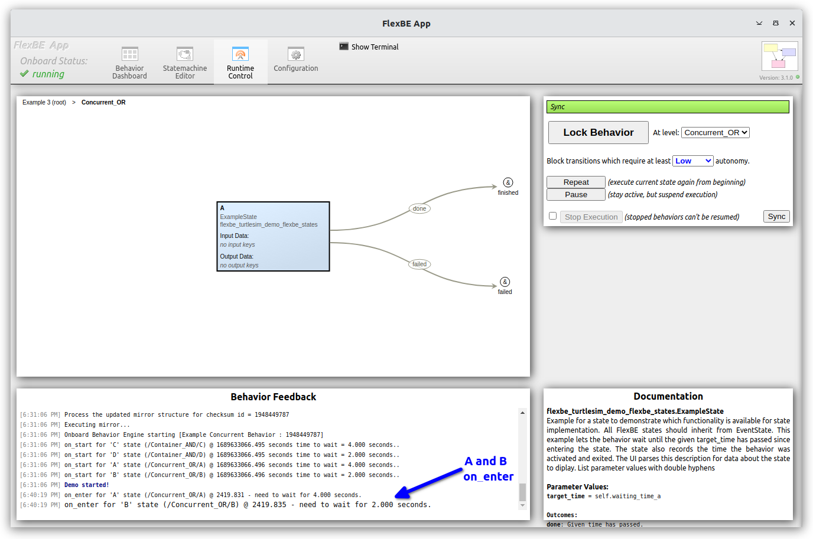
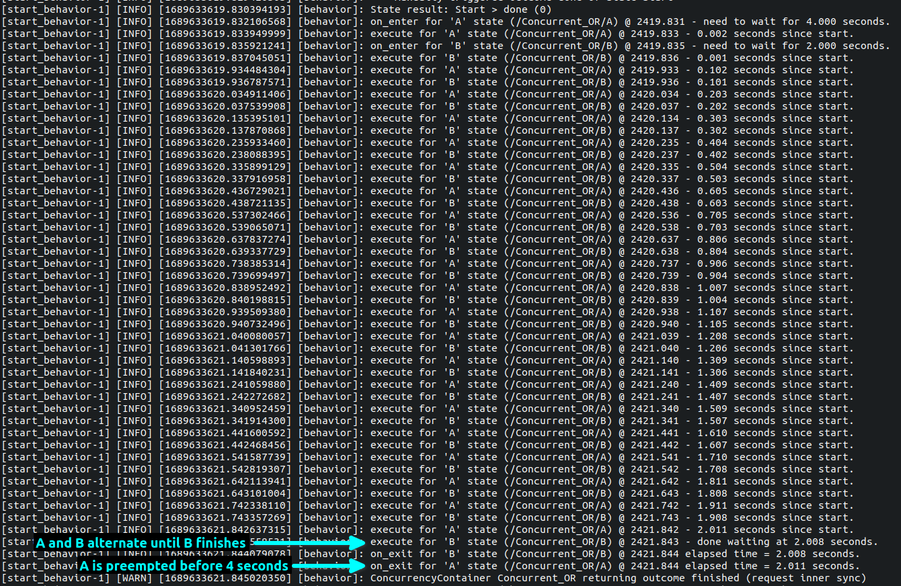
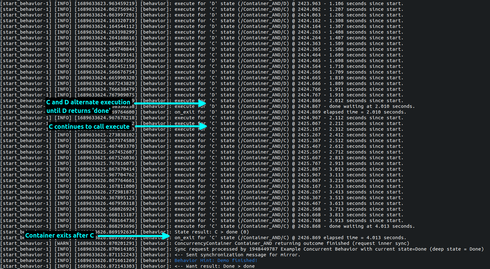

# 例3 - ConcurrencyContainersによる階層的有限ステートマシン（HFSM）

`例3`のビヘイビアは、[`ConcurrencyContainer`](https://github.com/FlexBE/flexbe_behavior_engine/blob/ros2-devel/flexbe_core/flexbe_core/core/concurrency_container.py)を使ってHFSMを構築します。

FlexBE システムを起動したら、FlexBE UI ダッシュボードから `Example 3` ビヘイビアを読み込みます。
下の左端の画像は読み込んだ後の設定ダッシュボードを示しており、右の画像は `ConcurrencyContainer` が表示された最上位のステートマシンを示しています。
画像をクリックすると高解像度版が表示されます。

<p float="center">
  
  
</p>

FlexBEには、他のステートマシンを保持する3種類の「コンテナ」があります。
それは、 `StateMachine`、`ConcurrencyContainer`、`PriorityContainer` です。
この例では、上の右側の画像のように `ConcurrencyContainer` を使用します。
`ConcurrencyContainer`は、実行サイクルの同じFlexBEの「tic」ですべてのサブステートを実行しますが、実際の同時実行や真の「並列」実行は行いません。 
同時実行コンテナ内では相互接続は許可されません。
しかし、`ConcurrencyContainer` は他のコンテナを個々の階層ステートとして、より複雑なステートマシンを含むことができます。

例3では、最上位のステートマシンは `Start`、`EnterAnd`、`Done`、`Failed` の4つの `LogState` ステートを使用しています。 
`Start` と `Done` ステートでは、メッセージにプライベート設定変数を使用し、一方、`EnterAnd` と `Failed` ステートでは、ステートプロパティエディットボックスに文字列を定義します。 
`WaitState`のインスタンスである `Delay` は `1.0` 秒の待ち時間パラメータを使用します。 
`Concurrent` コンテナ（ステートの実装は `ConcurrencyContainer` であるが、ラベルには `Concurrent` と表示されている）のいずれかをシングルクリックすると、下の左端の画像のようにステートのプロパティエディタペインが表示されます。 
`ConcurrencyContainer`のプロパティ領域では、許可される特定の結果を指定したり、コンテナの `userdata` キー名を設定したりすることができます。

プロパティ領域から「Open this container」を選択するか、ステートマシンのコンテナボックス `Concurrent`をダブルクリックして直接開くことができます。 コンテナビューを開くと、HFSM の最上位の下にあるステートマシンが表示されます。 
2つの（サブ）ステートマシンを以下に示します。

<p float="center">
  
  
  
</p>

上の左端の画像のように、`Concurrent_OR` コンテナには `A` と `B` というラベルの付いた `ExampleState` のインスタンスが2つ存在しています。
`A` または `B` が `done` を返すと、コンテナは `finished` を返すように、コンテナの結果 (outcome)は別々に接続されています。

上の一番右の図に示すように、`Concurrent_AND` コンテナには `C` と `D` というラベルの付いた`ExampleState` インスタンスが2つ存在しています。
したがって、コンテナが `finished` を返す前に `C` と `D` の両方が `done` を返す必要があります（つまり、`C` *と* `D` の両方が `done` であれば `finished` となります）。
どのような `failed` 結果でも、コンテナは `failed` を返します（つまり、`C` *または* `D` が失敗した場合は失敗したことになります）。

「Runtime Control」パネルでは、下の左端の画像のように待ち時間を調整することができます。 
この例では、`waiting_time_a` を `4.0` 秒に設定し、`waiting_time_b` を `2.0` 秒に設定しています。 
そのため、ステート `B` は最初に `done` を返し、約2.0秒後のステート `A` を無効にします。
同様に、`waiting_time_c` は `4.0` 秒に設定され、`waiting_time_d` は `2.0` 秒に設定さしています。
ステート `D` は約 2 秒後に実行を終了して `on_exit` を呼び出しますが、ステート `C` はさらに 2 秒間実行を続けます。

<p float="center">
  
  
  
</p>

オンボード端末のログには、`execute`メソッドの`Logger.localinfo`が含まれており、同時実行コンテナ内の1つのステートが実行されるまで、交互に「同時実行」ticを表示します。 
そして、出力がどのように接続されているかによってビヘイビアが異なります。
下の左端の画像は `Concurrent_OR` コンテナのビヘイビアを示しており、右端の画像は `Concurrent_AND` コンテナのビヘイビアを示しています。この例では 4.0 秒と 2.0 秒の待ち時間が設定されています。

<p float="center">
  
  
</p>

> 注: FlexBE UI の現在のリリースバージョン（3.x.x）では、`Concurrent` コンテナ内の最初のステートのみが表示されます。
> これは、そのステートが最初に終了する問題を引き起こす可能性があります。 
> 開発バージョンでは、最もアクティブなステートが表示され、内部ステートが変化すると更新されます。 関連する待ち時間を変更し、`Concurrent_AND`コンテナのUIを比較することをお勧めします。

さまざまな自律性レベルでビヘイビアを実行してみてください。

さて、ビヘイビアステートマシンの実装コードをもう少し見てみましょう。
このビヘイビアは[`example_3_sm.py`](../flexbe_turtlesim_demo_flexbe_behaviors/flexbe_turtlesim_demo_flexbe_behaviors/example_3_sm.py)で定義されています。
すべてのコード（以下に列挙）はFlexBE UIステートマシンエディタによって生成され、ビヘイビアが最初に作成されたとき（そしてその後修正されたとき）にダッシュボード経由で保存されます。 
ファイル名とクラス名 `Example3SM` は、最初に作成されたときに割り当てられたビヘイビア名 `Example 3` から派生したものです。
ビヘイビアの実装クラスは[`Behavior`クラス](https://github.com/FlexBE/flexbe_behavior_engine/blob/ros2-devel/flexbe_core/flexbe_core/behavior.py)を継承しています。

> 注：これはソースバージョンへのリンクです。 編集や変更は`install`フォルダに保存されます。

操作可能な調整可能パラメータは `Behavior` クラスの `add_parameter` インスタンスメソッドを使用して定義され、初期化されます。
インスタンスで使用される全てのステートは、ROSノードのインスタンス参照で初期化されます。 これらの値は OCS UI から `TODO - FIX THIS`(todo_fix_this_link) メッセージで通知されます。 一方、プライベートな設定変数は `create` メソッドでローカルに定義され、OCS 側からは通知されません。

```python
class Example3SM(Behavior):
    """
    並行ビヘイビアの例の定義。

    これは、ライフサイクルの各関数をログに記録するカスタムexample_stateを使用したビヘイビアの簡単な例です。
    
    ここでは、ORとANDスタイルの両方の終了条件を持つ並行ビヘイビアを示します。
    
    """

    def __init__(self, node):
        super().__init__()
        self.name = 'Example Concurrent Behavior'

        # parameters of this behavior
        self.add_parameter('waiting_time_a', 4.0)
        self.add_parameter('waiting_time_b', 2.0)
        self.add_parameter('waiting_time_c', 4.0)
        self.add_parameter('waiting_time_d', 2.0)

        # references to used behaviors
        OperatableStateMachine.initialize_ros(node)
        ConcurrencyContainer.initialize_ros(node)
        PriorityContainer.initialize_ros(node)
        Logger.initialize(node)
        flexbe_turtlesim_demo_flexbe_states__ExampleState.initialize_ros(node)
        LogState.initialize_ros(node)
        WaitState.initialize_ros(node)
```


ステートマシンは `create` インスタンスメソッドを使用して定義・作成されます。
最初に各コンテナがインスタンス化され、それらのサブステートが追加されます。
次に、最上位のステートマシンがインスタンス化され、コンテナのステートマシンを含む内部のステートが追加されます。
ステートの定義には、遷移先と必要な自律性のレベルが含まれる（例えば、`Start` ステートの `done` 結果は `Concurrent_OR` に遷移し、`Low` 自律性が必要）。
ステートによっては、パッケージ名が先頭に付加されているものがあります（例：`flexbe_turtlesim_demo_flexbe_states__ExampleState`）。

x座標とy座標のコメント行（例：`# x: 500 y:78`）は、UIステートマシンエディタでステートの位置や遷移アークの座標を記録するために使用されます。 したがって、このファイルは実行可能なPythonスクリプトとUIグラフィックスのソースの両方の役割を果たします。


```python
    def create(self):
        start_msg = "Demo started!"
        done_msg = "Demo finished!"
        # x:920 y:78, x:909 y:171
        _state_machine = OperatableStateMachine(outcomes=['finished', 'failed'])

        # Additional creation code can be added inside the following tags
        # [MANUAL_CREATE]

        # [/MANUAL_CREATE]
        # x:500 y:78, x:482 y:226, x:230 y:365, x:475 y:287, x:430 y:365
        _sm_container_and_0 = ConcurrencyContainer(outcomes=['finished', 'failed'], conditions=[
                                        ('finished', [('C', 'done'), ('D', 'done')]),
                                        ('failed', [('C', 'failed')]),
                                        ('failed', [('D', 'failed')])
                                        ])

        with _sm_container_and_0:
            # x:108 y:72
            OperatableStateMachine.add('C',
                                        flexbe_turtlesim_demo_flexbe_states__ExampleState(target_time=self.waiting_time_c),
                                        transitions={'done': 'finished', 'failed': 'failed'},
                                        autonomy={'done': Autonomy.Off, 'failed': Autonomy.Off})

            # x:110 y:173
            OperatableStateMachine.add('D',
                                        flexbe_turtlesim_demo_flexbe_states__ExampleState(target_time=self.waiting_time_d),
                                        transitions={'done': 'finished', 'failed': 'failed'},
                                        autonomy={'done': Autonomy.Off, 'failed': Autonomy.Off})


        # x:478 y:55, x:469 y:111, x:455 y:259, x:462 y:183, x:448 y:317, x:444 y:365
        _sm_concurrent_or_1 = ConcurrencyContainer(outcomes=['finished', 'failed'], conditions=[
                                        ('finished', [('A', 'done')]),
                                        ('finished', [('B', 'done')]),
                                        ('failed', [('A', 'failed')]),
                                        ('failed', [('B', 'failed')])
                                        ])

        with _sm_concurrent_or_1:
            # x:30 y:40
            OperatableStateMachine.add('A',
                                        flexbe_turtlesim_demo_flexbe_states__ExampleState(target_time=self.waiting_time_a),
                                        transitions={'done': 'finished', 'failed': 'failed'},
                                        autonomy={'done': Autonomy.Off, 'failed': Autonomy.Off})

            # x:30 y:168
            OperatableStateMachine.add('B',
                                        flexbe_turtlesim_demo_flexbe_states__ExampleState(target_time=self.waiting_time_b),
                                        transitions={'done': 'finished', 'failed': 'failed'},
                                        autonomy={'done': Autonomy.Off, 'failed': Autonomy.Off})


        with _state_machine:
            # x:52 y:78
            OperatableStateMachine.add('Start',
                                        LogState(text=start_msg, severity=Logger.REPORT_HINT),
                                        transitions={'done': 'Concurrent_OR'},
                                        autonomy={'done': Autonomy.Low})

            # x:565 y:166
            OperatableStateMachine.add('Container_AND',
                                        _sm_container_and_0,
                                        transitions={'finished': 'Done', 'failed': 'Failed'},
                                        autonomy={'finished': Autonomy.Inherit, 'failed': Autonomy.Inherit})

            # x:273 y:106
            OperatableStateMachine.add('Delay',
                                        WaitState(wait_time=1.0),
                                        transitions={'done': 'EnterAnd'},
                                        autonomy={'done': Autonomy.Off})

            # x:740 y:72
            OperatableStateMachine.add('Done',
                                        LogState(text=done_msg, severity=Logger.REPORT_HINT),
                                        transitions={'done': 'finished'},
                                        autonomy={'done': Autonomy.High})

            # x:424 y:107
            OperatableStateMachine.add('EnterAnd',
                                        LogState(text="Enter the AND Concurrent state ...", severity=Logger.REPORT_HINT),
                                        transitions={'done': 'Container_AND'},
                                        autonomy={'done': Autonomy.Off})

            # x:750 y:301
            OperatableStateMachine.add('Failed',
                                        LogState(text="Failure encountered", severity=Logger.REPORT_ERROR),
                                        transitions={'done': 'failed'},
                                        autonomy={'done': Autonomy.High})

            # x:128 y:201
            OperatableStateMachine.add('Concurrent_OR',
                                        _sm_concurrent_or_1,
                                        transitions={'finished': 'Delay', 'failed': 'Failed'},
                                        autonomy={'finished': Autonomy.Inherit, 'failed': Autonomy.Inherit})

        return _state_machine
```

`例3`で実験した後、[例4](../docs/example4.md)に進んで、この`例3`のビヘイビア全体を、`StateMachine`コンテナを使ったサブビヘイビアとして含む、2番目の階層型有限ステートマシン(HFSM)を見てください。