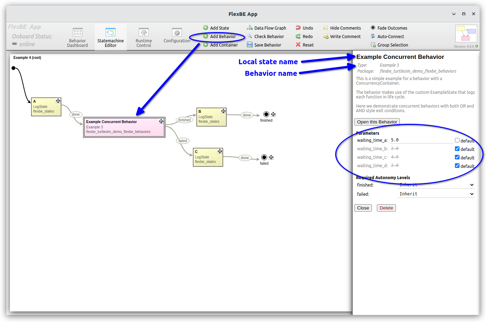
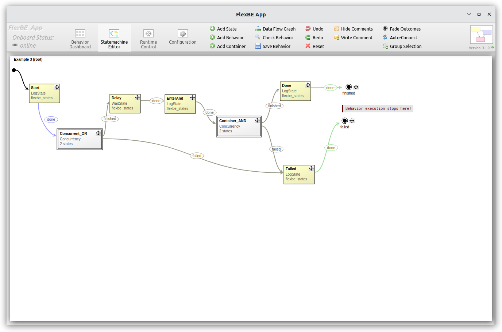

# Example 4 - Behavior composition - Using behaviors in other behaviors

The `Example 4` behavior constructs a three-layer HFSM with the `Example 3` behavior inside a `Behavior` container that contains multiple [`ConcurrencyContainer`](https://github.com/FlexBE/flexbe_behavior_engine/blob/ros2-devel/flexbe_core/flexbe_core/core/concurrency_container.py) states each with multiple `ExampleState`

  
  

Use the "Add Behavior" action shown circled in top of leftmost image; this will open the normal "Load Behavior" dialog.
From there, you can modify the local state name for the behavior container state.

Using the state editor view shown in the leftmost image above, you can modify the state machine parameters 
defined for the state machine (as defined in ["Example 3"](example3.md)).
In this example, we modified the `waiting_time_a`.

This ability to compose existing behaviors to build more complex behaviors is a powerful feature of FlexBE.

While this three-layer HFSM example is relatively trivial for illustrative purposes, FlexBE has been used to develop much 
more complex behaviors using behavior composition.

For some examples, see these publications:

- Stefan Kohlbrecher et al. ["A Comprehensive Software Framework for Complex Locomotion and Manipulation Tasks Applicable to Different Types of Humanoid Robots."](http://dx.doi.org/10.3389/frobt.2016.00031) Frontiers in Robotics and AI 3 (2016): 31.

- Alberto Romay et al., [“Collaborative autonomy between high-level behaviors and human operators for remote manipulation tasks using different humanoid robots,”](http://dx.doi.org/10.1002/rob.21671) Journal of Field Robotics, September 2016.

