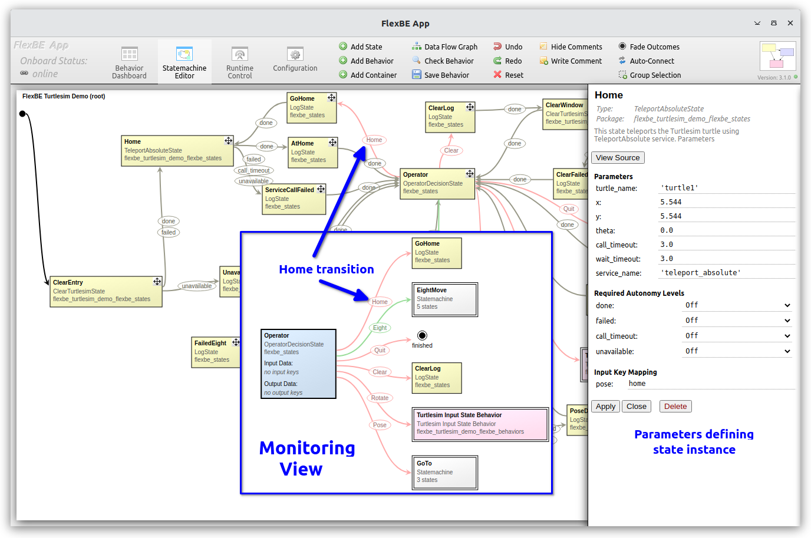

# Turtlesim Demo Home Behavior

The "Home" sub-behavior is implemented by a sequence of states as shown below:

<p float="center">
  
</p>

This behavior is first invoked on initial entry to the `FlexBE Turtlesim Demo` behavior 
after clearing the screen.  After that, the behavior is invoked by selecting the "Home" transition 
from the "Operator" decision state shown in the monitoring view.

The active state first transitions to the "GoHome" [`LogState`](https://github.com/FlexBE/flexbe_behavior_engine/blob/ros2-devel/flexbe_states/flexbe_states/log_state.py) with the message text `"Go to home position"`, then it transitions to the "Home" state instance of the [`TeleportAbsoluteState`](../flexbe_turtlesim_demo_flexbe_states/flexbe_turtlesim_demo_flexbe_states/teleport_absolute_state.py) 
state implementation.  The result is then logged by either "AtHome" or "ServiceCallFailed" states, and the system transitions back to the
"Operator" decision state.

As shown in the code fragment below, the `TeleportAbsoluteState` provides a FlexBE interface to the [`TeleportAbsolute`](https://docs.ros2.org/latest/api/turtlesim/srv/TeleportAbsolute.html) service provided by the `turtlesim` node.  The node can accept the position as either input parameters in the `__init__` method invocation, or as `userdata`.
For a more indepth discussion of `userdata` see the ["Rotate"](rotate_behavior.md) discussion.

The `__init__` method constructor sets up a [`ProxyServiceCaller`](https://github.com/FlexBE/flexbe_behavior_engine/blob/ros2-devel/flexbe_core/flexbe_core/proxy/proxy_service_caller.py) instance to handle the actual calls. FlexBE uses a number of *Proxy* interfaces 
to allow multiple states to share a single access point to the node for publish, subscribing, and calling interfaces to other nodes.
The onboard system maintains a single ROS `node` as its point of access to external nodes.


```python 
from rclpy.duration import Duration
from flexbe_core import EventState, Logger
from flexbe_core.proxy import ProxyServiceCaller

from turtlesim.srv import TeleportAbsolute


class TeleportAbsoluteState(EventState):
    """
    This state teleports the Turtlesim turtle using TeleportAbsolute service.

    Parameters
    -- turtle_name   string     Turtle name (default: `turtle1`)
    -- x             float      x position (default: 0.0)
    -- y             float      y position (default: 0.0)
    -- theta         float      yaw orientation angle (radians) (default: 0.0)
    -- call_timeout  float      Timeout for completion (default: 3.0 seconds)
    -- wait_timeout  float      Duration to wait for service to become available (default: 3.0 seconds)
    -- service_name  string     Service name (default: `teleport_absolute`)

    Outcomes
    <= done             Service call returned result as expected
    <= failed           Failed to make service call successfully
    <= call_timeout     Service call did not return timely result
    <= unavailable      Service is unavailable

    User data
    ># pose      float[]     Optional 2 (x, y) or 3 elements (x, y, theta_radians) as list of numbers
    """

    def __init__(self, turtle_name='turtle1', x=0.0, y=0.0, theta=0.0,
                 call_timeout=3.0, wait_timeout=3.0, service_name='teleport_absolute'):
        """Declare outcomes, input_keys, and output_keys by calling the EventState super constructor."""

        super().__init__(outcomes=['done', 'failed', 'call_timeout', 'unavailable'],
                         input_keys=['pose'])

        ProxyServiceCaller.initialize(TeleportAbsoluteState._node)

        # Store state parameters for later use.
        self._call_timeout = Duration(seconds=call_timeout)
        self._wait_timeout = Duration(seconds=wait_timeout)

        # The constructor is called when building the state machine, not when actually starting the behavior.
        # Thus, we cannot save the starting time now and will do so later.
        self._start_time = None
        self._return = None  # Track the outcome so we can detect if transition is blocked
        self._service_called = False

        self._srv_topic = f'/{turtle_name}/{service_name}'
        self._srv_result = None

        self._srv_request = TeleportAbsolute.Request()
        self._srv_request.x = x
        self._srv_request.y = y
        self._srv_request.theta = theta

        self._error = None

        # Set up the proxy now, but do not wait on the service just yet
        self._srv = ProxyServiceCaller({self._srv_topic: TeleportAbsolute}, wait_duration=0.0)
```

Given the above state implementation, the `FlexBE Turtlesim Demo` behavior defines an instance of this class, 
and adds it to the top level state machine in [`flexbe_turtlesim_demo_sm.py`](../flexbe_turtlesim_demo_flexbe_behaviors/flexbe_turtlesim_demo_flexbe_behaviors/flexbe_turtlesim_demo_sm.py).

A fragment of the `flexbe_turtlesim_demo_sm.py` behavior implementation is shown below.  The values assigned 
in the `TeleportAbsoluteState()` constructor are taken from the FlexBE editor window shown above.

```python
_state_machine = OperatableStateMachine(outcomes=['finished'])

with _state_machine:
    # x:178 y:77
    OperatableStateMachine.add('Home',
                                TeleportAbsoluteState(turtle_name='turtle1', x=5.544, y=5.544, theta=0.0,
                                                        call_timeout=3.0, wait_timeout=3.0,
                                                        service_name='teleport_absolute'),
                                transitions={'done': 'AtHome', 'failed': 'ServiceCallFailed',
                                            'call_timeout': 'ServiceCallFailed',
                                            'unavailable': 'ServiceCallFailed'},
                                autonomy={'done': Autonomy.Off, 'failed': Autonomy.Off, 'call_timeout': Autonomy.Off,
                                            'unavailable': Autonomy.Off},
                                remapping={'pose': 'home'})

    # x:651 y:133
    OperatableStateMachine.add('Operator',
                                OperatorDecisionState(outcomes=["Home", "Eight", "Quit", "Clear", "Rotate", "Pose"],
                                                        hint="Eight", suggestion="Eight"),
                                transitions={'Home': 'GoHome', 'Eight': 'EightMove', 'Quit': 'finished',
                                            'Clear': 'ClearLog', 'Rotate': 'Turtlesim Input State Behavior',
                                            'Pose': 'GoTo'},
                                autonomy={'Home': Autonomy.Full, 'Eight': Autonomy.High,
                                            'Quit': Autonomy.Full, 'Clear': Autonomy.Full,
                                            'Rotate': Autonomy.Full, 'Pose': Autonomy.Full})


    # x:461 y:80
    OperatableStateMachine.add('AtHome',
                                LogState(text="Turtle is home!", severity=Logger.REPORT_HINT),
                                transitions={'done': 'Operator'},
                                autonomy={'done': Autonomy.Off})


```

For this discusion, we will stick to high level overview. For more details about the state lifecycle see the [Examples](examples.md). 

When the "Home" state becomes active the `on_enter` method of `TeleportAbsoluteState` class is called.
If the system is using `userdata` the desired pose is extracted.  For our case, we have remapped the name `pose` to the `home`` `userdata` defined on the behavior dashboard.  Again, for a more indepth discussion of `userdata` see the ["Rotate"](rotate_behavior.md) discussion.

If this `userdata` is not provided, then the state defaults to using the parameters defined in the by the creation 
in `flexbe_turtlebot_demo_sm` code above.

The state instance makes note of the `self._start_time`, and if available the service call is invoked using an asychronous (non-blocking) 
service call (constrast with ["Clear"](clear_behavior.md) discussion ).  
If an exception occurs, the state `self._return` is marked as `failed`.


```python 
    def on_enter(self, userdata):
        """
        Call this method when the state becomes active.

        i.e. a transition from another state to this one is taken.
        """

        if 'pose' in userdata and isinstance(userdata.pose, (list, tuple)):
            try:
                self._srv_request.x = float(userdata.pose[0])
                self._srv_request.y = float(userdata.pose[1])
                self._srv_request.theta = 0.0
                if len(userdata.pose) == 3:
                    # setting angle is optional
                    self._srv_request.theta = float(userdata.pose[2])

                Logger.localinfo(f"Using position = ({self._srv_request.x:.3f}, {self._srv_request.y:.3f}), "
                                 f"angle={self._srv_request.theta:.3f} radians from userdata")

            except Exception as exc:  # pylint: disable=W0703
                Logger.logwarn(f"{self._name}: Invalid pose userdata {userdata.pose} - "
                               f"needs list of 2 or 3 numbers!\n  {type(exc)} - {exc}")
                self._return = 'failed'
                return
        else:
            Logger.localinfo(f"Using position = ({self._srv_request.x:.3f}, {self._srv_request.y:.3f}), "
                             f"angle={self._srv_request.theta:.3f} radians")

        self._start_time = self._node.get_clock().now()
        self._return = None  # reset the completion flag
        self._service_called = False
        try:
            if self._srv.is_available(self._srv_topic, wait_duration=0.0):
                self._do_service_call()
            else:
                Logger.logwarn(f"{self._name}: Service {self._srv_topic} is not yet available ...")
        except Exception as exc:
            Logger.logerr(f"{self._name}: Service {self._srv_topic} exception {type(exc)} - {str(exc)}")
            self._return = 'failed'

    def _do_service_call(self):
        """Make the service call using async non-blocking."""
        try:
            Logger.localinfo(f"{self._name}: Calling service {self._srv_topic} ...")
            self._srv_result = self._srv.call_async(self._srv_topic, self._srv_request, wait_duration=0.0)
            self._start_time = self._node.get_clock().now()  # Reset timer for call timeout
            self._service_called = True
        except Exception as exc:
            Logger.logerr(f"{self._name}: Service {self._srv_topic} exception {type(exc)} - {str(exc)}")
            raise exc

```

The `on_enter` method is called once when the state becomes the active state in the state machine after a transition.
From there on, the FlexBE behavior executive calls the `execute` method periodically at a desired rate until something other 
than `None` is returned.

If the service has been called, we wait for the result up until the designated timeout period has elapsed.  If the service 
was not available `on_enter`, we call when it becomes available up until the designated timeout period.

```python
    def execute(self, userdata):
        """
        Execute this method periodically while the state is active.

        If no outcome is returned, the state will stay active.
        """
        if self._return:
            # We have completed the state, and therefore must be blocked by autonomy level
            return self._return

        if self._service_called:
            # Waiting for result.
            # We will do this in a non-blocking way
            if self._srv.done(self._srv_topic):
                _ = self._srv.result(self._srv_topic)  # grab empty result, but nothing to check here presume success
                self._return = 'done'
            else:

                if self._node.get_clock().now().nanoseconds - self._start_time.nanoseconds > self._call_timeout.nanoseconds:
                    # Failed to return call in timely manner
                    self._return = 'call_timeout'
                    Logger.logerr(f"{self._name}: Service {self._srv_topic} call timed out!")
        else:
            # Waiting for service to become available in non-blocking manner
            if self._srv.is_available(self._srv_topic, wait_duration=0.0):
                Logger.localinfo(f"{self._name}: Service {self._srv_topic} is now available - making service call!")
                self._do_service_call()
                # Process the result on next execute call (so some delay)
            else:
                if self._node.get_clock().now().nanoseconds - self._start_time.nanoseconds > self._wait_timeout.nanoseconds:
                    # Failed to return call in timely manner
                    self._return = 'unavailable'
                    Logger.logerr(f"{self._name}: Service {self._srv_topic} is unavailable!")

        return self._return
```

This example has demonstrated using an asynchronous service call within FlexBE.
For comparison with a blocking service call, see the ["Clear"](clear_behavior.md) discussion.

[Back to the overview](../README.md#selectable-transitions)

