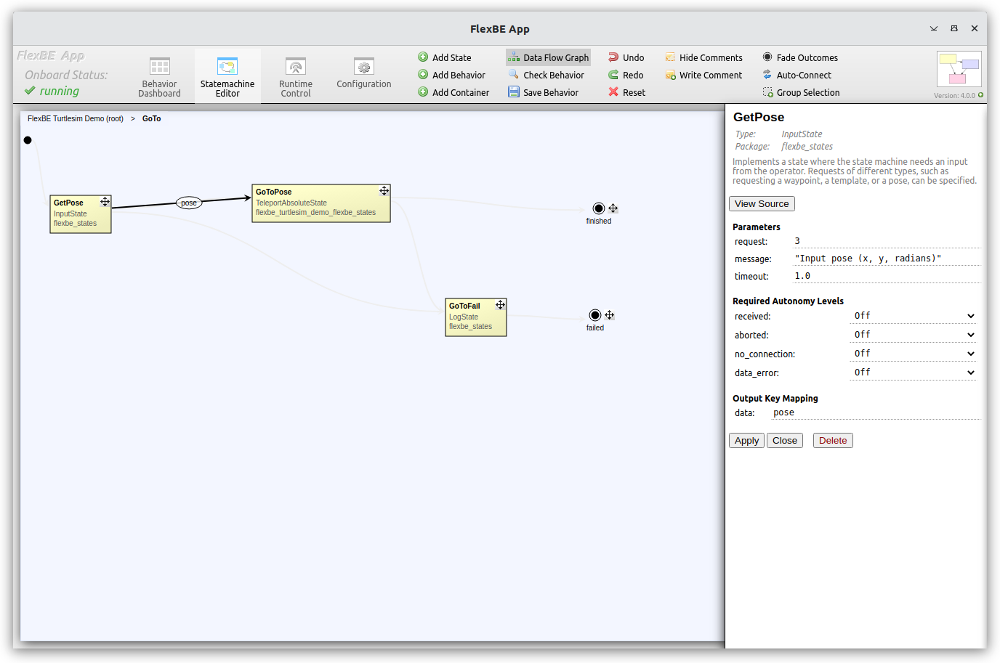
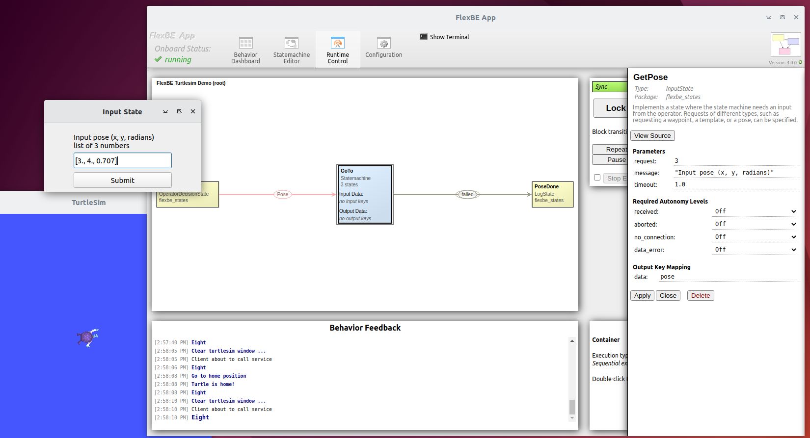

# Pose Behavior

The "Pose" transition makes use a `StateMachine` container with three states, including the 
`InputState` discussed in ["Rotate"](rotate_behavior.md) and 
`TeleportAbsoluteState` first discused in ["Home"](home_behavior.md).

The `InputState` remaps its `userdata` `data` key to provide the `pose` key used by the `TeleportAbsoluteState`.

<p float="center">
  
  
</p>

In the `InputState` configuration, we 
  * specify result type 3 ([`BehaviorInput.Goal.REQUEST_3D`](https://github.com/FlexBE/flexbe_behavior_engine/blob/ros2-devel/flexbe_msgs/action/BehaviorInput.action)) to request a `list` (or `tuple`) of three numbers from the user, 
  * specify the prompt message for the user interface
  * specify a timeout value for the `input_action_server` to become available
  * specify the output `userdata` key mapping (e.g. `pose` in this case)

> Note: For 2D, 3D, 4D request types, we accept `list` (e.g. '[1., 2, 3]'), `tuple` (e.g. '(1., 2, 3)'),
> or just a comma separated string of numbers (e.g. '1., 2, 3') of the appropriate length as input on the UI.

> Note: The `InputState` `timeout` refers to waiting for the action server to become available. 
> The system will wait indefinitely for the operator to respond.

The `TeleportAbsoluteState` extracts the pose data from the `userdata` and makes the non-blocking service call as described in ["Home"](home_behavior.md).

```python
        if 'pose' in userdata and isinstance(userdata.pose, (list, tuple)):
            try:
                self._srv_request.x = float(userdata.pose[0])
                self._srv_request.y = float(userdata.pose[1])
                self._srv_request.theta = 0.0
                if len(userdata.pose) == 3:
                    # setting angle is optional
                    self._srv_request.theta = float(userdata.pose[2])

                Logger.localinfo(f"Using position = ({self._srv_request.x:.3f}, {self._srv_request.y:.3f}), "
                                 f"angle={self._srv_request.theta:.3f} radians from userdata")

            except Exception as exc:  # pylint: disable=W0703
                Logger.logwarn(f"{self._name}: Invalid pose userdata {userdata.pose} - "
                               f"needs list of 2 or 3 numbers!\n  {type(exc)} - {exc}")
                self._return = 'failed'
                return
        else:
            Logger.localinfo(f"Using position = ({self._srv_request.x:.3f}, {self._srv_request.y:.3f}), "
                             f"angle={self._srv_request.theta:.3f} radians")
```
----

This example discussed the use of `InputState` to provide more complex operator data to the onboard behavior in collaborative autonomy.
See ["Rotate"](rotate_behavior.md) and ["Home"](home_behavior.md) discussions for more details about the individual states, and 
["Eight"](eight_loop.md) for more discussion of the `StateMachine` container.


[Back to the overview](../README.md#selectable-transitions)
