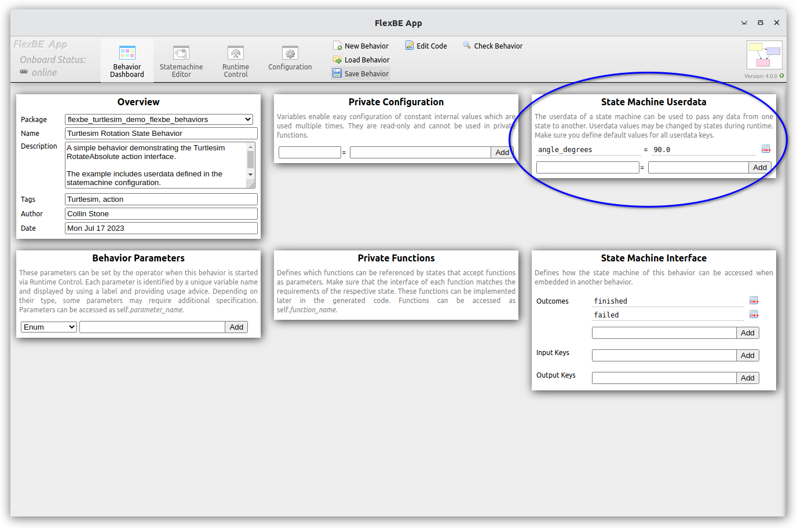
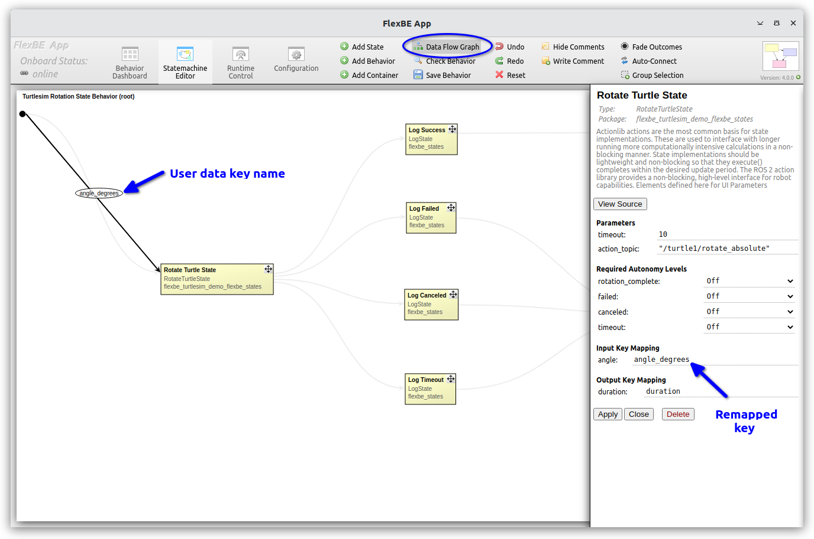
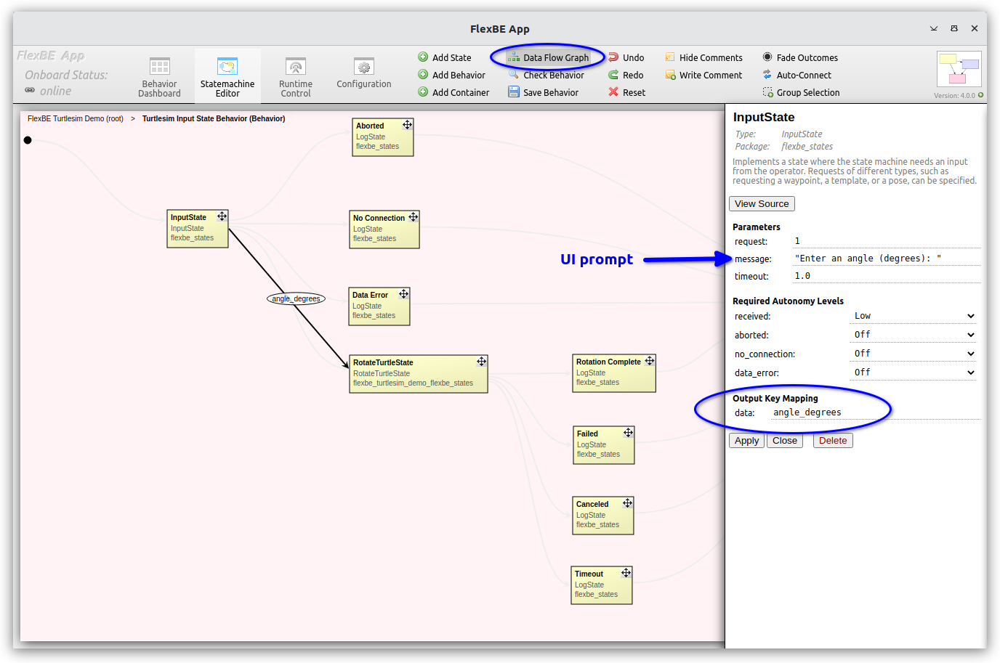
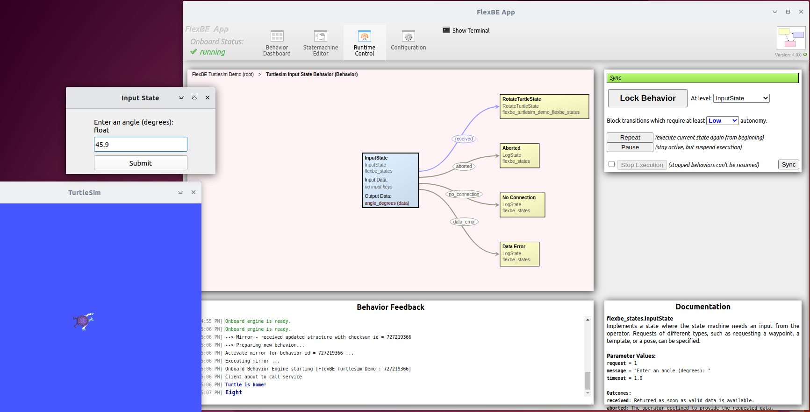

# RotateTurtleState and Userdata

Two key parts of FlexBE that extends the concept beyond pure state machines are:
* 1) composition of behaviors into HFSM
* 2) `userdata` that can be passed from one state to another.

For example, the [`RotateTurtleState`](../flexbe_turtlesim_demo_flexbe_states/flexbe_turtlesim_demo_flexbe_states/rotate_turtle_state.py) uses
`userdata` to define the desired angle.

We will begin our discussion with a simpler example behavior and then return to the specifics of the "Rotate" transition in `FlexBE Turtlesim Demonstration`.

----

### `Turtlesim Rotation State Behavior`

Separate from the `Turtlesim Input State Behavior` sub-behavior used by the `FlexBE Turtlesim Demo`, 
we have provided a simpler `Turtlesim Rotation State Behavior` behavior.

We will start by describing that first, you may load this behavior and execute if you wish.

Each FlexBE state can accept data according to specified `Input Keys`.
These key names can be remapped to a different name at the state level.

For example, the `RotateTurtleState` implementation specifies an input key called `angle` and 
an output key `duration that is passed to downstream states.

```Python
class RotateTurtleState(EventState):
    """
    ...
    Parameters
    -- timeout             Maximum time allowed (seconds)
    -- action_topic        Name of action to invoke

    Outputs
    <= rotation_complete   Only a few dishes have been cleaned.
    <= failed              Failed for some reason.
    <= canceled            User canceled before completion.
    <= timeout             The action has timed out.

    User data
    ># angle     float     Desired rotational angle in (degrees) (Input)
    #> duration  float     Amount time taken to complete rotation (seconds) (Output)

    """

    def __init__(self, timeout, action_topic="/turtle1/rotate_absolute"):
        # See example_state.py for basic explanations.
        super().__init__(outcomes=['rotation_complete', 'failed', 'canceled', 'timeout'],
                         input_keys=['angle'],
                         output_keys=['duration'])

        self._timeout = Duration(seconds=timeout)
        self._timeout_sec = timeout
        self._topic = action_topic

        # Create the action client when building the behavior.
        # Using the proxy client provides asynchronous access to the result and status
        # and makes sure only one client is used, no matter how often this state is used in a behavior.
        ProxyActionClient.initialize(RotateTurtleState._node)

        self._client = ProxyActionClient({self._topic: RotateAbsolute},
                                         wait_duration=0.0)  # pass required clients as dict (topic: type)

        # It may happen that the action client fails to send the action goal.
        self._error = False
        self._return = None  # Retain return value in case the outcome is blocked by operator
        self._start_time = None

```

Internally, the state implementation will use `userdata.angle` to access the stored data
using the FlexBE core [`userdata.py` class](https://github.com/flexbe/flexbe_behavior_engine/flexbe_core/flexbe_core/userdata.py) that
extends the capabilities of the basic `dict` object.

In the `Turtlesim Rotation State Behavior` behavior, we define
the `userdata` at the FlexBE UI Dashboard as `angle_degrees`, the desired
angle in degrees.  In the `RotateTurtleState` editor, we specify that the required `angle` key 
uses the remapped `angle_degrees` key value as shown below.

<p float="center">
  
  
</p>

The right image also shows the `Data Flow` view allows the behavior designer to view how `userdata`
is passed through the state machine.  Once defined, a `userdata` key/value pair
persists for the life of the state machine.

Now when the state is executed the turtle will rotate to the key value that was defined after converting to `radians` as required by the
[`RotateAbsolute`](https://docs.ros2.org/foxy/api/turtlesim/action/RotateAbsolute.html) action provided by `Turtlesim`.

> Note: Normally, we suggest you stick to a consistent convention
> for passing data, and ROS uses `radians` for angles by convention.  
> Here, we chose `degrees` to illustrate data conversions and for operator convenience at the UI.

The `userdata` is passed to the standard `on_enter`, `execute`, and `on_exit` methods of each FlexBE state.
Here we validate the data and use to create a `Goal` request for the `RotateAbsolute` action.

```python
def on_enter(self, userdata):

    # make sure to reset the error state since a previous state execution might have failed
    self._error = False
    self._return = None

    if 'angle' not in userdata:
        self._error = True
        Logger.logwarn("RotateTurtleState requires userdata.angle key!")
        return

    # Recording the start time to set rotation duration output
    self._start_time = self._node.get_clock().now()

    goal = RotateAbsolute.Goal()

    if isinstance(userdata.angle, (float, int)):
        goal.theta = (userdata.angle * math.pi) / 180  # convert to radians
    else:
        self._error = True
        Logger.logwarn("Input is %s. Expects an int or a float.", type(userdata.angle).__name__)

    # Send the goal.
    try:
            self._client.send_goal(self._topic, goal, wait_duration=self._timeout_sec)
    except Exception as e:
        # Since a state failure not necessarily causes a behavior failure,
        # it is recommended to only print warnings, not errors.
        # Using a linebreak before appending the error log enables the operator to collapse details in the GUI.
        Logger.logwarn('Failed to send the RotateAbsolute command:\n%s' % str(e))
        self._error = True
```

Then in the `execute` method we monitor for the successful result, and
set the outgoing `userdata.duration` value.  This will be stored in the
global `userdata` instance according to the remapping defined in the state edit window above.

```python
def execute(self, userdata):
    # While this state is active, check if the action has been finished and evaluate the result.

    # Check if the client failed to send the goal.
    if self._error:
        return 'failed'

    if self._return is not None:
        # Return prior outcome in case transition is blocked by autonomy level
        return self._return

    # Check if the action has been finished
    if self._client.has_result(self._topic):
        _ = self._client.get_result(self._topic)  # The delta result value is not useful here
        userdata.duration = self._node.get_clock().now() - self._start_time
        Logger.loginfo('Rotation complete')
        self._return = 'rotation_complete'
        return self._return

    if self._node.get_clock().now().nanoseconds - self._start_time.nanoseconds > self._timeout.nanoseconds:
        # Checking for timeout after we check for goal response
        self._return = 'timeout'
        return 'timeout'

    # If the action has not yet finished, no outcome will be returned and the state stays active.
    return None
```

To demonstrate "collaborative autonomy" aspects of FlexBE,
the next section discusses the "Rotate" transition from the `FlexBE Turtlesim Demonstration`.

----

## "Rotate" - Collaborative Autonomy with Operator Input

The "Rotate" sub-behavior is used to illustrate several features of FlexBE.

#### InputState and Collaborative Autonomy

The [FlexBE Behavior Engine](https://github.com/flexbe/flexbe_behavior_engine) provides an [`InputState`](https://github.com/flexbe/flexbe_behavior_engine/flexbe_states/flexbe_states/input_state.py)
that accepts operator data via a [`BehaviorInput` action](https://github.com/flexbe/flexbe_behavior_engine/flexbe_msgs/action/BehaviorInput.action) interface.

Additionally, FlexBE provides a simple action server with PyQt based UI window as part of the [`flexbe_input` package](https://github.com/flexbe/flexbe_behavior_engine/flexbe_input).

`ros2 run flexbe_input input_action_server`

When the FlexBE onboard `InputState` requests data of a given type, the
UI window will open, prompt the user with the provided text, and wait for user input.
After the user presses `Enter/Return` or clicks the `Submit` button, the data is serialized and 
sent back to the `InputState` as a string of bytes data as part of the action result.

> Note: The `InputState` makes use of the `pickle` module, and is subject to this warning from the Pickle manual:

>   Warning The pickle module is not secure against erroneous or maliciously constructed data. 
>   Never unpickle data received from an untrusted or unauthenticated source.

#### Sub-behaviors with Behavior Container 

In the `FlexBE Turtlesim Demo` statemachine,
 the container labeled `Rotate` is itself a simple state machine;
 that is, we have a Hierarchical Finite State Machine (HFSM).
 Furthermore, it is not just a state machine as in the ["Eight"](eight_loop.md), but is in fact a separate behavior 
 [`Turtlesim Input State Behavior`](../flexbe_turtlesim_demo_flexbe_behaviors/flexbe_turtlesim_demo_flexbe_behaviors/turtlesim_input_state_behavior_sm.py) that can be loaded and executed in FlexBE independent of `FlexBE Turtlesim Demo` behavior.

<p float="center">
  
  
</p>

In the `InputState` configuration, we 
  * specify result type 1 ([`BehaviorInput.Goal.REQUEST_FLOAT`](https://github.com/FlexBE/flexbe_behavior_engine/blob/ros2-devel/flexbe_msgs/action/BehaviorInput.action)) to request a single number from the user, 
  * specify the prompt message for the user interface
  * specify a timeout value for the `input_action_server` to become available
  * specify the output userdata key mapping

> Note: For float types, we accept integer values without decimals as well.

> Note: The `InputState` `timeout` refers to waiting for the action server to become available. 
> The system will wait indefinitely for the operator to respond.


When running the sub-behavior after requesting "Rotate", the `input_action_server` will pop up the dialog shown in rightmost image,
which displays the specified prompt and a result type prompt specified by action goal (in this case a `1` for a `float`).

After submitting the value, the operator will need to confirm "received" transition if running in "Low" autonomy, the rotate state will then 
execute the rotate action using the provided `userdata`.

#### ROS 2 Action Interfaces

Both the `InputState` and `RotateTurtleState` make use of ROS [action](https://docs.ros.org/en/iron/Tutorials/Beginner-CLI-Tools/Understanding-ROS2-Actions/Understanding-ROS2-Actions.html) interfaces.

These are the preferred way of interacting with external nodes within FlexBE.

The `InputState` uses an action client that interacts with the `input_action_server` that provides a [`BehaviorInput`](https://github.com/FlexBE/flexbe_behavior_engine/blob/ros2-devel/flexbe_msgs/action/BehaviorInput.action) server interface.

The `turtlesim` node provides a [`RotateAbsolute`](https://docs.ros2.org/foxy/api/turtlesim/action/RotateAbsolute.html) action server interface.

Both of these FlexBE states make use of a [`ProxyActionClient`](https://github.com/FlexBE/flexbe_behavior_engine/blob/ros2-devel/flexbe_core/flexbe_core/proxy/proxy_action_client.py) that is set up in the `__init__` method of each state class.

```python
        self._client = ProxyActionClient({self._topic: RotateAbsolute},
                                         wait_duration=0.0)  # pass required clients as dict (topic: type)
```
FlexBE uses "proxies" to provide a single interface for all states in a behavior.  This reduces the number of independent communication 
channels that are required.

Typically you create the `_client` in the constructor, and then make use of the proxy instance as needed in `on_enter`, and `execute`.

If the state exits before the goal (e.g. if operator requests preemption), then we normally cancel the action goal `on_exit`.

```python
    def on_exit(self, userdata):
        # Make sure that the action is not running when leaving this state.
        # A situation where the action would still be active is for example when the operator manually triggers an outcome.

        if not self._client.has_result(self._topic):
            self._client.cancel(self._topic)
            Logger.loginfo('Cancelled active action goal.')
```
----

This example discussed the use of `InputState` to provide operator data to the onboard behavior in collaborative autonomy, the use of behavior composition to define more complex behaviors, and the use of ROS 2 `action` interfaces as the main approach to interacting with 
more computationally intensive external nodes.

[Back to the overview](../README.md#selectable-transitions)
